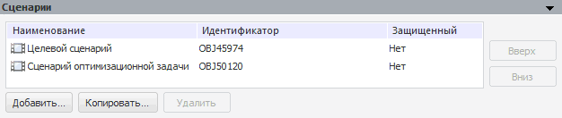
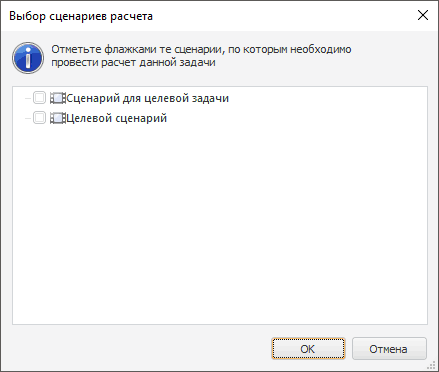

# Сценарии моделирования (настольное приложение)

Сценарии моделирования (настольное приложение)
-

# Сценарии

Сценарное моделирование - это моделирование, при котором рассматривается
 несколько альтернативных вариантов развития модели. Является одним из
 наиболее эффективных инструментов стратегического анализа.

Сценарии моделирования - объект, предназначенный для создания в моделируемой
 переменной ряда, в который будут выгружены данные после окончания расчёта
 задачи моделирования.

Для управления всеми сценариями, которые существуют в контейнере моделирования,
 используйте [панель
 сценариев моделирования](../../2_2_Window_container/Scenario_Of_Modeling.htm).

Все сценарии, по которым рассчитывается задача моделирования, отображаются
 на панели «Сценарии»:

Примечание.
 На данной панели отображаются только сценарии, на которые у пользователя
 есть право на чтение. Если родительским объектом контейнера моделирования
 является база данных временных рядов, то права доступа на сценарий «Факт» не учитываются.

При копировании контейнера моделирования будут копироваться только сценарии,
 на которые у пользователя есть права.

По умолчанию в контейнере моделирования присутствует сценарий «Факт», который не отображается
 на данной панели. Сценарий «Факт»
 используется во всех переменных, моделях и задачах моделирования для получения
 данных на периоде идентификации. Если другие сценарии отсутствуют, то
 результаты расчёта могут быть выгружены по сценарию «Факт».

[Особенности
 сценарного моделирования](javascript:TextPopup(this))

	Для получения результатов расчёта на весь период прогнозирования
	 по всем выходным переменным и по определенному сценарию учитывайте
	 особенности рассчитываемых моделей. В зависимости от необходимости
	 наличия сценарных данных модели можно классифицировать следующим образом:

		- прогнозные модели, не предусматривающие
		 использование факторов («[ARIMA](../2_3_2_Model/Specification/1_Arima/uimodelling_model_specification_arima.htm)»,
		 «[Экспоненциальное сглаживание](../2_3_2_Model/Specification/5_Exponential_smoothing/uimodelling_model_specification_exponential.htm)»,
		 «[Грей-метод](../2_3_2_Model/Specification/UiModelling_Specification_GrayForecast.htm)» и другие). Для
		 идентификации модели входная переменная должна содержать данные
		 на весь период идентификации по сценарию «Факт».
		 Результаты расчёта данных моделей по разным сценариям отличаться
		 не будут;

		- прогнозные модели, предусматривающие
		 использование факторов («[Детерминированное
		 уравнение](../2_3_2_Model/Specification/4_Deterministic_equation/uimodelling_model_specification_deter.htm)», «[Линейная
		 регрессия (оценка МНК)](../2_3_2_Model/Specification/8_Linear_regression/uimodelling_model_specification_linaer_reg.htm)», «[Нелинейная
		 регрессия (оценка нелинейным МНК)](../2_3_2_Model/Specification/7_Nonlinear_regression/7_nonlinear_regression.htm)» и другие). Для идентификации
		 модели все входные переменные должны содержать данные на весь
		 период идентификации по сценарию «Факт»
		 (для детерминированного уравнения идентификация не требуется).
		 Для расчёта прогнозных значений по сценариям входные переменные-факторы
		 должны содержать данные на периоде прогнозирования по всем используемым
		 сценариям. Если моделируемая переменная используется в качестве
		 фактора с лагом, то для расчёта первой точки прогноза по требуемому
		 сценарию в моделируемой переменной необходимы данные на последнюю
		 точку на период идентификации (в соответствии со значением лага)
		 по сценарию «Факт».

## Операции со сценариями

[Для
 добавления сценария](javascript:TextPopup(this))

		- Перетащите сценарий из панели «[Сценарии
		 моделирования](../../2_2_Window_container/Scenario_Of_Modeling.htm)».

		- Нажмите кнопку «Добавить»
		 или выполните одноименную команду контекстного меню. Будет открыт
		 диалог «Выбор сценариев расчета»,
		 содержащий список всех доступных сценариев в текущем контейнере
		 моделирования:

	

	Отметьте флажками сценарии, которые необходимо
	 использовать в задаче. Для работы с отметкой предусмотрено контекстное
	 меню:

		-

			- Отметить.
			 Устанавливает флажки для выбранных элементов дерева. Если
			 среди них есть папка, то она отмечается вместе с дочерними
			 элементами;

			- Снять
			 отметку. Снимает флажки для выбранных элементов дерева.
			 Если среди них есть папка, то отметка снимается и с её дочерних
			 элементов.

			- Отметить
			 все. Устанавливает флажки для всех элементов;

			- Снять
			 отметку со всех. Снимает флажки для всех элементов.

[Для
 копирования данных по выбранному сценарию в заданные переменные](javascript:TextPopup(this))

		- Нажмите кнопку «Копировать».

		- Выполните одноименную команду контекстного меню.

	Будет открыт диалог:

	

	Определите параметры:

		-

			- Источник.
			 Укажите сценарий, данные которого будут копироваться;

			- Новый
			 сценарий. Задайте наименование и идентификатор нового
			 сценария, в который будет произведено копирование данных;

			- Переменные.
			 В списке содержатся все переменные, которые используются при
			 расчете задачи моделирования. Отметьте флажками те переменные,
			 в которые требуется скопировать данные.

			- Отметить
			 все. Снять отметку.
			 Кнопки предназначены для работы с отметкой элементов в списке
			 переменных.

[Для изменения
 порядка следования сценариев](javascript:TextPopup(this))

		- Используйте кнопки «Вверх»/«Вниз».

		- Используйте одноименные команды контекстного меню.

[Для удаления
 выбранных сценариев](javascript:TextPopup(this))

		- Нажмите кнопку «Удалить».

		- Выполните одноименную команду контекстного меню.

	Будет запрошено подтверждение выполняемого действия.

См. также:

[Задача
 моделирования](uimodelling_problem.htm)

		Справочная
		 система на версию 10.9
		 от 18/08/2025,
		 © ООО «ФОРСАЙТ»,
