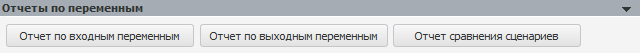
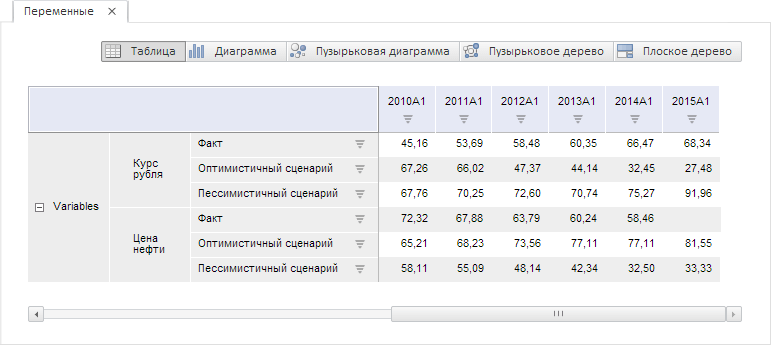
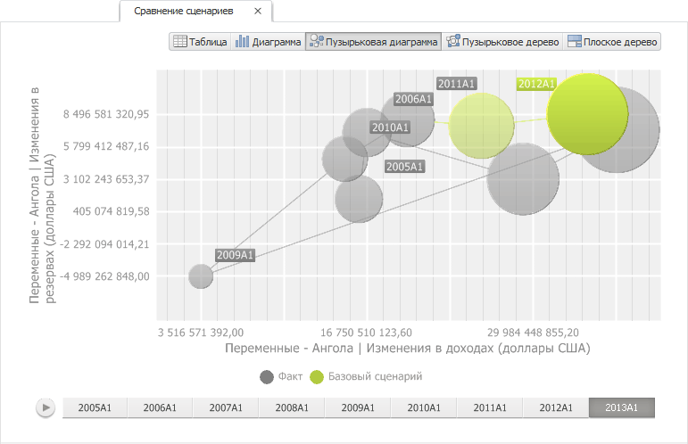

# Получение отчетов по переменным

Получение отчетов по переменным
-

# Получение отчетов по переменным

Панель «Отчеты по переменным»
 предназначена для получения сводных отчётов по всем входным/выходным переменным,
 включённым в задачу моделирования. Сценарное измерение отчетов содержит
 все сценарии, по которым может быть рассчитана задача моделирования.

Входная переменная задачи - переменная, которая не является выходной
 ни в одной из моделей, входящих в задачу. Выходная переменная задачи -
 переменная, которая является выходной хотя бы в одной модели, входящей
 в задачу.

Входными переменными модели могут быть:

	- исходная переменная, если она не совпадает с моделируемой переменной;

	- фактор, если он не используется в качестве моделируемой переменной.

Выходной переменной в модели является моделируемая переменная. Выходной
 переменной также является фактор или исходная переменная, если она совпадает
 с моделируемой переменной.

Для открытия отчёта, содержащего данные определенного типа переменных,
 используйте кнопки «Отчет по входным
 переменным» и «Отчет по выходным
 переменным». Для получения отчета, содержащего данные всех переменных
 с возможностью сравнить данные по всем сценариям, присутствующим в задаче
 моделирования, используйте кнопку «Отчет
 сравнения сценариев»:

Отчет будет открыт в новом окне.

Все отчеты содержат лист «Переменные»,
 содержащий входные и выходные переменные в табличном виде за выбранный
 период по всем учитываемым сценариям. Например:

Отчет сравнения сценариев дополнительно содержит лист «Сравнение
 сценариев», содержащий входные и выходные переменные, представленные
 в виде пузырьковой диаграммы. В качестве объектов наблюдений используются
 сценарии, в качестве метрик - переменные. Особенностью данной пузырьковой
 диаграммы является то, что для каждого пузырька рисуется траектория его
 движения. Например:

См. также:

[Задача
 моделирования](uimodelling_problem.htm)

		Справочная
		 система на версию 10.9
		 от 18/08/2025,
		 © ООО «ФОРСАЙТ»,
