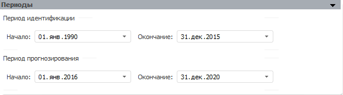
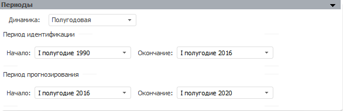

# Периоды

Периоды
-

# Периоды

Вид панели периоды отличается в зависимости от типа задачи моделирования:

	- задача прогнозирования и задача
	 трансформации:

		- Период идентификации.
		 Задайте период идентификации, используемый моделями при расчете
		 модельного ряда. Для моделей существует возможность задать собственный
		 [период
		 идентификации](../2_3_2_Model/Standart_Model/UiModelling_Model_2.htm), отличный от периода идентификации всей задачи;

		- Период прогнозирования.
		 Задайте период прогнозирования, используемый моделями при расчете
		 прогноза, верхней и нижней доверительных границ ряда;

Примечание.
 Задача моделирования будет рассчитана, если периоды расчета задачи моделирования
 не выходят за границы периодов источника данных контейнера моделирования,
 содержащего задачу.

	- задача оптимального управления
	 и Forward-Looking прогнозирования:

		- Динамика. Задайте
		 динамику, по которой будет рассчитываться задача. От выбора динамики
		 зависит формат задания периодов идентификации и прогнозирования.
		 Например, если выбрана годовая динамика, то задать нужно будет
		 только год, в если выбрана полугодовая, то необходимо задать полугодие
		 и год и т.д.

Остальные параметры на данной панели совпадают
 с параметрами панели для задач прогнозирования и трансформации.

См. также:

[Задача
 моделирования](uimodelling_problem.htm)

		Справочная
		 система на версию 10.9
		 от 18/08/2025,
		 © ООО «ФОРСАЙТ»,
