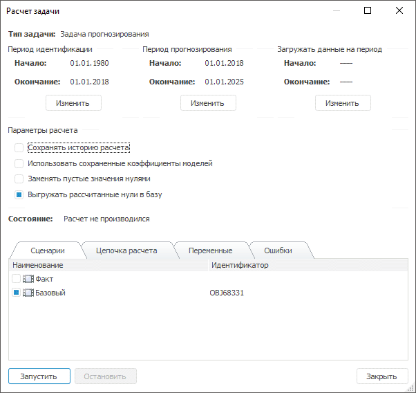
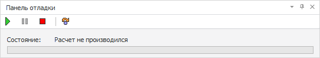
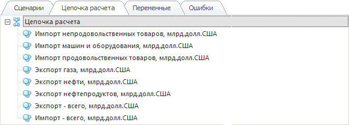
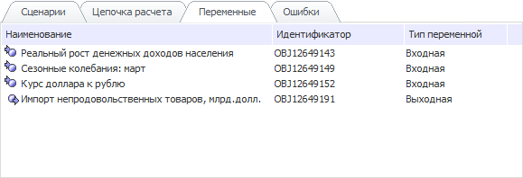
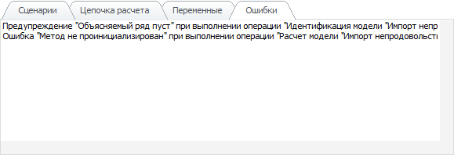
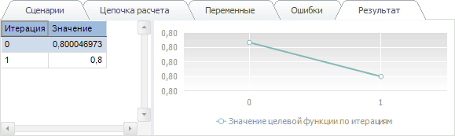

# Расчет задачи (настольное приложение)

Расчет задачи (настольное приложение)
-

# Расчет задачи

Перед началом расчета все изменения, внесенные в задачу, должны быть
 сохранены. Доступны сплошной и пошаговый типы расчета задачи. При сплошном
 расчете задача рассчитывается от начала и до конца без автоматической
 остановки на каждом шаге. При пошаговом расчете остановка выполняется
 после каждого шага расчета.

Для запуска сплошного расчета:

	- нажмите кнопку  на панели инструментов;

	- выполните команду «Рассчитать»
	 в контекстном меню задачи на панели «[Объекты
	 контейнера](../../2_2_Window_container/uimodelling_window_object.htm)» или в главном меню «Задача».

Для запуска пошагового расчета:

	- выполните команду «Рассчитать
	 пошагово» в контекстном меню задачи на панели «[Объекты контейнера](../../2_2_Window_container/uimodelling_window_object.htm)» или в главном меню
	 «Задача».

Независимо от типа расчета будет открыто окно «Расчет
 задачи»:

Настройте параметры расчета задачи:

[1.
 Укажите тип рассчитываемой задачи](javascript:TextPopup(this))

	Примечание.
	 Возможность доступна только для [целевой
	 задачи](uimodelling_problem_2.htm).

	В раскрывающемся списке «Тип задачи»
	 укажите тип целевой задачи:

		- задача оптимального управления.
		 Задача состоит в отыскании таких значений управляющих переменных,
		 при которых будет выполнено условие оптимизации значения целевой
		 функции;

		- задача прогнозирования.
		 Модели, входящие в задачу, рассчитываются последовательно в каждой
		 точке сценария: сначала рассчитываются все модели по первой точке
		 сценария, затем происходит расчет всех моделей по второй точке
		 сценария и т.д.

[2.
 Задайте периоды идентификации и прогнозирования](javascript:TextPopup(this))

	По умолчанию периоды идентификации и прогнозирования совпадают с
	 периодами, заданными на панели «[Периоды](uimodelling_problem_5.htm)».
	 Для корректировки данных периодов используйте группы параметров «Период идентификации» и «Период
	 прогнозирования».

	Операции с периодом:

		- изменение границ периода.
		 Нажмите кнопку «Изменить».
		 В полях «Начало» и «Окончание» будет доступно изменение
		 даты. Укажите требуемые временные границы периода;

		- сброс границ периода.
		 Нажмите кнопку «Сбросить».
		 Границы периода будут возвращены в исходное состояние. Сброс границ
		 периода доступен, если они были изменены.

[3.
 Задайте период загрузки данных](javascript:TextPopup(this))

	Изменение периода загрузки позволяет загружать лишь необходимые
	 данные и тем самым оптимизировать расчет задачи. По умолчанию период
	 загрузки данных не задан и даты начала и окончания загрузки определяются
	 автоматически после запуска задачи на расчет.

	Для задания периода загрузки данных используйте группу параметров
	 «Загружать данные на период».
	 Задание периода загрузки данных выполняется аналогично заданию [периодов идентификации
	 и прогнозирования](uimodelling_problem_run.htm#calc_period).

[4.
 Настройте параметры расчета задачи](javascript:TextPopup(this))

	В группе «Параметры расчета»
	 задайте следующие параметры:

		- Сохранять историю расчета.
		 При установке флажка будет сохранена [история
		 расчета](../2_3_6_History/uimodelling_work_object_History.htm) задачи. По умолчанию флажок снят и история расчета
		 не сохраняется;

	Примечание.
	 В истории расчета могут сохраняться модели, созданные только на переменных
	 моделирования.

		- Использовать сохраненные
		 коэффициенты моделей. При установке флажка будут использованы
		 значения коэффициентов, которые были сохранены ранее, что ускорит
		 процесс расчета. Сохранение коэффициентов возможно только для
		 модели линейной регрессии. По умолчанию флажок снят и коэффициенты
		 рассчитываются перед расчетом задачи;

		- Заменять пустые значения
		 нулями. При установке флажка пустые значения в переменных
		 заменяются нулями. По умолчанию флажок снят и переменные остаются
		 с пустыми значениями;

		- Выгружать рассчитанные
		 нули в базу. По умолчанию флажок установлен и нулевые значения,
		 полученные при расчете задачи, будут выгружены в базу данных.
		 Если флажок снят, то после расчета задачи в базу данных сохраняются
		 только ненулевые значения.

[5.
 Выберите сценарии расчета](javascript:TextPopup(this))

	Для выбора сценария расчета используйте вкладку «Сценарии».
	 На ней отображаются [сценарии](uimodelling_problem_3.htm),
	 добавленные для задачи моделирования, на которые у пользователя есть
	 право на чтение и на запись.

	Каждому сценарию соответствует флажок. Если флажок, соответствующий
	 сценарию, установлен, то сценарий участвует в расчете задачи. Расчет
	 производится последовательно по всем сценариям, которые отмечены флажками.
	 По умолчанию отмечены все сценарии, кроме системного сценария «Факт».

	Примечание.
	 При запуске задачи прогнозирования расчет будет осуществляться поточечно,
	 а не последовательно: сначала рассчитываются все модели по первой
	 точке первого сценария, затем происходит расчет всех моделей по первой
	 точке второго сценария и т.д.

[6.
 Запустите расчет задачи](javascript:TextPopup(this))

	Для запуска расчета задачи нажмите кнопку «Запустить».

		- При сплошном расчете
		 наименование данной кнопки изменится на «Приостановить»,
		 при нажатии которой расчет задачи приостанавливается. Для продолжения
		 расчета нажмите кнопку «Продолжить»,
		 для прерывания - «Остановить».

		Если в процессе расчета задачи возникли ошибки или предупреждения,
		 то они будут отображены на вкладке «[Ошибки](uimodelling_problem_run.htm#errors)».

		- При пошаговом расчете
		 окно «Расчет задачи» будет
		 закрыто и будет отображена «Панель
		 отладки»:

	

	В строке «Состояние»
	 отображается текущее состояние расчета. Для выполнения пошагового
	 расчета используйте следующие кнопки:

			- 
			 - выполняет расчет одного шага задачи;

			-  - запускает
			 расчет задачи до конца без остановок на каждом шаге;

			-  - приостанавливает расчет задачи;

			- 
			 - останавливает расчет задачи.

	Если в процессе расчета задачи возникли
	 ошибки или предупреждения, то они будут отображены в строке «Состояние».

## Просмотр информации о задаче

Для просмотра информации о задаче предназначены вкладки, расположенные
 в нижней части диалога «Расчет задачи»:

[Цепочка
 расчета](javascript:TextPopup(this))

	

	На вкладке отображена [цепочка
	 расчета](../2_3_3_MetaModel/uimodelling_metamodel.htm), состоящая из моделей. Для редактирования требуемой модели
	 дважды щёлкните по ней.

[Переменные](javascript:TextPopup(this))

	

	На вкладке отображен список используемых переменных, указан их тип
	 (входная/выходная) и идентификатор. Для просмотра данных переменной
	 дважды щёлкните по ней.

[Ошибки](javascript:TextPopup(this))

	

	На вкладке отображаются ошибки, возникшие при расчете задачи.

[Результат](javascript:TextPopup(this))

	

	На вкладке расположена таблица, содержащая данные об итерациях:
	 номер итерации и значение целевой функции на этой итерации. На основе
	 таблицы строится линейная диаграмма.

	Примечание.
	 Вкладка присутствует только для [задачи
	 оптимального управления](uimodelling_problem_2.htm) при сплошном типе расчета.

См. также:

[Задача
 моделирования](uimodelling_problem.htm) | [Идентифицированное
 уравнение](../2_3_2_Model/Standart_Model/identified_equation.htm)

		Справочная
		 система на версию 10.9
		 от 18/08/2025,
		 © ООО «ФОРСАЙТ»,
