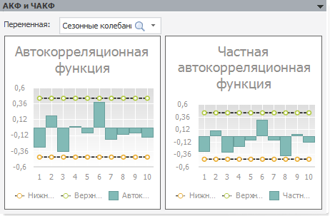

# АКФ и ЧАКФ: описательные статистики (настольное приложение)

АКФ и ЧАКФ: описательные статистики (настольное приложение)
-

# АКФ и ЧАКФ

Панель «АКФ и ЧАКФ»:

На панели отображаются результаты [автокорреляционного
 анализа](Lib.chm::/05_Statistics/UiModelling_Autocorrelation.htm) выбранной переменной: графики выборочной
 автокорреляционной функции (ACF) и частной автокорреляционной функции
 (PACF), которые используются для идентификации модели. Пунктиром отображаются
 границы доверительных интервалов.

Динамика расчета определяется на панели «[Период
 расчета](uimodelling_work_object_Period.htm)».

См. также:

[Описательные
 статистики](uimodelling_work_object_descriptive.htm) |  [Автокорреляционный
 анализ](Lib.chm::/05_Statistics/UiModelling_Autocorrelation.htm)

		Справочная
		 система на версию 10.9
		 от 18/08/2025,
		 © ООО «ФОРСАЙТ»,
