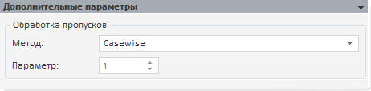

# Дополнительные параметры (описательные статистики)

Дополнительные параметры (описательные статистики)
-

# Дополнительные параметры

На панели определяется метод обработки пропусков ряда (отсутствующих
 значений) для тестов, в которые можно передать данный параметр, например,
 тест Гранжера:

Доступные методы обработки пропусков аналогичны методам модели «[Заполнение
 пропусков](../2_3_2_Model/Specification/UiModelling_Specification_Working_Lost.htm)». Также доступен дополнительный метод:

	- Casewise. Используется
	 по умолчанию. Расчеты ведутся без учета отсутствующих значений.

Примечание.
 Для описательных статистик всегда будет использоваться метод Casewise.

См. также:

[Описательные статистики](uimodelling_work_object_descriptive.htm)

		Справочная
		 система на версию 10.9
		 от 18/08/2025,
		 © ООО «ФОРСАЙТ»,
