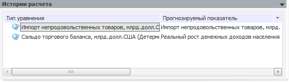

# История расчета

История расчета
-

# История расчета

Для сохранения истории расчёта установите флажок «Сохранять
 историю расчета» перед выполнением задачи моделирования. Сохранённые
 расчёты отображаются в виде дочерних объектов задачи моделирования.

Примечание.
 В истории расчета могут сохраняться модели, созданные только на переменных
 моделирования.

Для просмотра выбранной истории:

	- выполните команду «Редактировать»
	 в контекстном меню истории;

	- нажмите кнопку  на панели «[Объекты
	 контейнера](../../2_2_Window_container/uimodelling_window_object.htm)»;

	- дважды щёлкните по истории.

В рабочей области будут открыты панели для просмотра истории расчёта:

	- [Описание](../2_3_1_Value/uimodelling_work_object_value_1.htm). Аналогична одноименной
	 панели объекта «[Переменная](../2_3_1_Value/uimodelling_work_object_value.htm)»;

	- Отчет по переменным;

	- Истории расчета.

Также в рабочей области будут отображены и другие панели с результатами
 расчета в зависимости от выбранной модели на панели «Истории
 расчета».

## Отчет по переменным

На панели содержится список переменных, используемых для расчёта задачи
 моделирования.

Отчёт формируется на основе данных переменных, которые отмечены флажками.
 Установка и снятие флажков выполняется с помощью мыши или команд контекстного
 меню. Для открытия отчёта нажмите кнопку «Открыть
 отчет».

## Истории расчета

На панели содержится список моделей, которые были рассчитаны.

Если в списке выбрана модель, то отображаются панели с результатами
 её расчёта. Набор отображаемых панелей зависит от типа модели.

По умолчанию отображаются результаты расчёта для первой модели в списке.

См. также:

[Расчет задачи](../2_3_4_Problem/uimodelling_problem_run.htm)

		Справочная
		 система на версию 10.9
		 от 18/08/2025,
		 © ООО «ФОРСАЙТ»,
