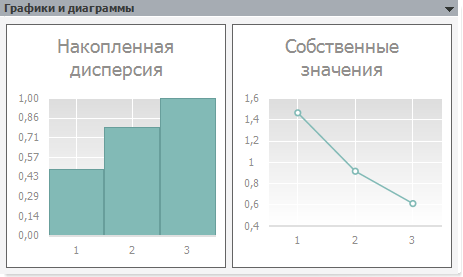

# Графики и диаграммы (методы главных компонент)

Графики и диаграммы (методы главных компонент)
-

# Графики и диаграммы

Панель отображает результаты расчётов в графическом виде:

Панель содержит два графика «Накопленная
 дисперсия» и «Собственные значения».

См. также:

[Метод главных компонент](uimodelling_work_object_MethPrinComp.htm)

		Справочная
		 система на версию 10.9
		 от 18/08/2025,
		 © ООО «ФОРСАЙТ»,
