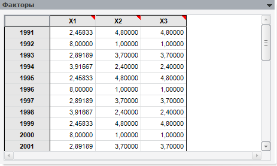

# Факторы: метод главных компонент (настольное приложение)

Факторы: метод главных компонент (настольное приложение)
-

# Факторы

На данной панели в табличном виде отображаются значения входных переменных
 (факторов):

См. также:

[Метод главных компонент](uimodelling_work_object_MethPrinComp.htm)

		Справочная
		 система на версию 10.9
		 от 18/08/2025,
		 © ООО «ФОРСАЙТ»,
