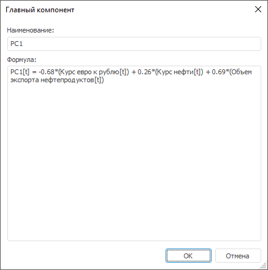
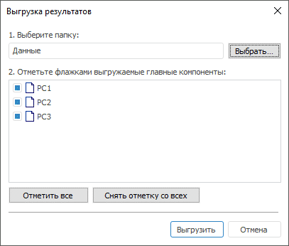

# Собственные векторы

Собственные векторы
-

# Собственные векторы

Панель содержит таблицу со значениями собственных векторов и собственных
 чисел (собственное значение, дисперсия, накопленная дисперсия). В столбцах
 расположены главные компоненты:

Заголовки главных компонент являются гиперссылками, при нажатии которых
 открывается диалог, отображающий информацию о выбранном главном компоненте,
 например:

	- Наименование. Наименование
	 главного компонента. Значение доступно для редактирования.

	- Формула. Сформированная
	 формула главного компонента, которая формируется путем сложения множителей,
	 представляющих произведение коэффициента на соответствующий ему фактор
	 (переменную).

Для выгрузки результатов нажмите кнопку «Выгрузить
 результаты» на панели «Собственные
 векторы». Будет открыто окно:

Нажмите кнопку «Выбрать» и укажите
 папку в текущем контейнере моделирования, в которую будут выгружены результаты.
 Отметьте флажками главные компоненты, которые необходимо выгрузить.

После выгрузки результатов в указанной папке будут созданы:

	- исходные переменные (факторы);

	- переменные, соответствующие отмеченным главным компонентам,
	 в качестве способа загрузки которых используется детерминированное
	 уравнение;

	- модели, соответствующие отмеченным главным компонентам, для
	 которых используется детерминированное уравнение с формулами главных
	 компонент.

См. также:

[Метод главных компонент](uimodelling_work_object_MethPrinComp.htm)

		Справочная
		 система на версию 10.9
		 от 18/08/2025,
		 © ООО «ФОРСАЙТ»,
