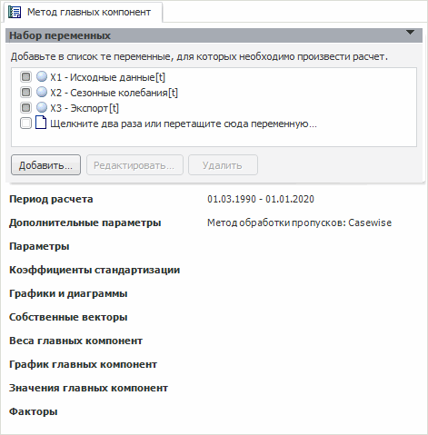

# Метод главных компонент

Метод главных компонент
-

# Метод главных компонент

Метод главных компонент (англ. Principal
 component analysis, PCA) предназначен для выявления латентных обобщающих
 характеристик изучаемого процесса. Метод используется для подбора факторов,
 выделяя основные компоненты из входных данных.

По результатам расчета главные компоненты можно использовать для построения
 детерминированного уравнения, которое является удобным средством для сохранения
 и использования результатов данного метода и для дальнейшего построения
 более сложных моделей.

Для расчета метода выполните команду главного меню «Анализ
 > Метод главных компонент». Будет открыта вкладка, на которой
 осуществляется редактирование параметров метода.

Если в дереве объектов до выполнения команды была выделена какая-либо
 переменная, то она автоматически добавляется в набор переменных.

Примечание.
 При расчете метод главных компонент рассматривает набор переменных как
 выборку, а не как генеральную совокупность.

Метод главных компонент содержит панели:

	- аналогичные панелям [описательных
	 статистик](../2_3_5_Descriptive_Value/uimodelling_work_object_descriptive.htm):

	-

		- [Набор
		 переменных](../2_3_5_Descriptive_Value/uimodelling_work_object_des_collection.htm)

		- [Период
		 расчета](../2_3_5_Descriptive_Value/uimodelling_work_object_Period.htm)

		- [Дополнительные
		 параметры](../2_3_5_Descriptive_Value/uimodelling_work_object_ExtraParameters.htm)

	- собственные панели:

	-

		- [Параметры](UiModelling_WorkObject_MethPrinComp.htm)

		- [Коэффициенты
		 стандартизации](UiModelling_WorkObject_MethPrinComp_StandFac.htm)

		- [Графики
		 и диаграммы](UiModelling_WorkObject_MethPrinComp_Chart.htm)

		- [Собственные
		 векторы](UiModelling_WorkObject_MethPrinComp_OwnVector.htm)

		- [Веса
		 главных компонент](UiModelling_WorkObject_MethPrinComp_WeightComp.htm)

		- [График
		 главных компонент](UiModelling_WorkObject_MethPrinComp_ChartPrinComp.htm)

		- [Значения
		 главных компонент](UiModelling_WorkObject_MethPrinComp_ValPrinComp.htm)

		- [Факторы](UiModelling_WorkObject_MethPrinComp_Factors.htm)

См. также:

[Объект «Переменная»](../2_3_1_Value/uimodelling_work_object_value.htm)

		Справочная
		 система на версию 10.9
		 от 18/08/2025,
		 © ООО «ФОРСАЙТ»,
