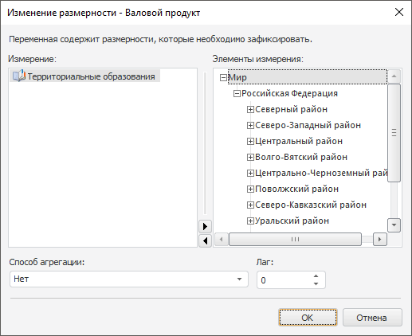

# Изменение размерности

Изменение размерности
-

# Изменение размерности

Изменение размерности требуется, если переменная содержит дополнительные
 измерения.

Примечание.
 Изменение размерности доступно, если контейнер моделирования работает
 в [режиме на переменных](../../1_Modelling/Start_Modelling.htm).

Для изменения размерности используйте диалог «Изменение
 размерности», который открывается автоматически:

При выборе измерения в списке «Измерение»
 в дереве «Элементы измерения»
 отображаются его элементы, по которым можно произвести фиксацию. Для элементов
 измерения можно задать способ агрегации. Выбор производится из раскрывающегося
 списка поля «Способ агрегации»,
 возможны следующие виды агрегации:

	- Сумма. Суммируются элементы
	 уровня-источника;

	- Минимум. На уровне-источнике
	 выбирается минимальное значение;

	- Максимум. На уровне-источнике
	 выбирается максимальное значение;

	- Количество непустых.
	 Определяется количество непустых значений на уровне-источнике;

	- Количество пустых. Определяется
	 количество пустых значений на уровне-источнике;

	- Количество всех дочерних.
	 Определяется количество дочерних элементов на уровне-источнике;

	- Арифметическое среднее.
	 Определяется [среднее значение](Lib.chm::/05_Statistics/UiModelling_Avg.htm) элементов уровня-источника с учетом пустых
	 значений;

	- Фактическое среднее.
	 Определяется [среднее значение](Lib.chm::/05_Statistics/UiModelling_Avg.htm) элементов уровня-источника без учета пустых
	 значений;

	- Первое фактическое.
	 На уровне-источнике берется первое имеющееся (фактическое) значение;

	- Последнее фактическое.
	 На уровне-источнике берется последнее имеющееся (фактическое) значение;

	- Среднеквадратическое отклонение
	 по выборке. Определяется [среднеквадратическое отклонение](Lib.chm::/UiModelling_ArgSqDev.htm) ряда по выборке;

	- Медиана. Определяется
	 [медиана](Lib.chm::/05_Statistics/UiModelling_Median.htm)
	 для значений на уровне-источнике;

	- Среднеквадратическое отклонение.
	 Определяется [среднеквадратическое
	 отклонение](Lib.chm::/UiModelling_ArgSqDev.htm) ряда по генеральной совокупности.

Также в поле «Лаг» можно задать
 лаг. Данный параметр отвечает за сдвиг ряда вперед на заданное количество
 точек во временном периоде.

См. также:

[Объект «Модель»](2_3_2_Model/UiModelling_Model.htm)

		Справочная
		 система на версию 10.9
		 от 18/08/2025,
		 © ООО «ФОРСАЙТ»,
