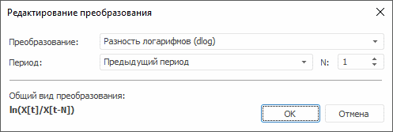
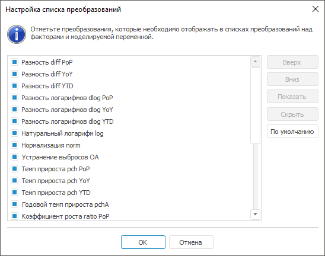

# Преобразования над переменными или факторами

Преобразования над переменными или факторами
-

# Преобразования над переменными или факторами

Над переменными и факторами возможны следующие преобразования:

	- Нет. Преобразование
	 не осуществляется (используется по умолчанию);

	- Натуральный логарифм log.
	 Осуществляется логарифмирование точек моделируемой переменной: ln(X[t]);

	- Разность логарифмов.
	 Находится разность логарифмов соседних точек моделируемой переменной
	 за определенный период (ln(X[t]/X[t-N])):

	-

		- dlog PoP. Предыдущий
		 период;

		- dlog YoY. Соответствующий
		 период предыдущего года;

		- dlog YTD. Конец
		 предыдущего года;

	- Темп прироста. Осуществляется
	 расчёт темпа прироста в процентах к выбранному периоду (X[t]/X[t-N]-1)*100):

	-

		- pch PoP. Предыдущий
		 период;

		- pch YoY. Соответствующий
		 период предыдущего года;

		- pch YTD. Конец предыдущего
		 года;

	- Разность. Осуществляется
	 преобразование y[t] = X[t] – X[t-N]
	 за определенный период:

	-

		- diff PoP. Предыдущий
		 период;

		- diff YoY. Соответствующий
		 период предыдущего года;

		- diff YTD. Конец
		 предыдущего года;

	- Нормализация norm. Осуществляется
	 нормализация точек моделируемой переменной: X[t]/σ(X),
	 где σ -[среднеквадратическое
	 отклонение](Lib.chm::/05_Statistics/UiModelling_ArgSqDev.htm) ряда;

	- Стандартизация std.
	 Осуществляется стандартизация точек моделируемой переменной: (X[t]-M(X))/σ(X), где σ
	 - [среднеквадратическое
	 отклонение](Lib.chm::/05_Statistics/UiModelling_ArgSqDev.htm) ряда, M
	 - [среднее
	 значение](Lib.chm::/05_Statistics/UiModelling_Avg.htm)
	 ряда;

	- Коэффициент роста. Осуществляется
	 расчёт темпа роста за определенный период (X[t]/X[t-N]):

	-

		- ratio PoP. Предыдущий
		 период;

		- ratio YoY. Соответствующий
		 период предыдущего года;

		- ratio YTD. Конец
		 предыдущего года;

	- Годовой темп прироста pchA.
	 Осуществляется расчёт годового темпа прироста в процентах: (((X[t]/X[t-1])^S)-1)*100,
	 где S - число периодов в
	 году;

	- Детрендирование. Производится
	 устранение тренда по формуле: X[t]-f(X(t),
	 S), где f(X(t), S)
	 - тренд ряда, S - [вид
	 тренда](Lib.chm::/02_Time_series_analysis/UiModelling_TrendCurveEstimation.htm):

	-

		- (Линейный тренд) TS Linear;

		- (Полиномиальный тренд)
		 TS Polynomial;

		- (Логарифмический тренд)
		 TS Logarithmic;

		- (Обратный тренд) TS Inverse;

	- Устранение сезонности.
	 Осуществляется устранение с помощью метода «[Census1](Lib.chm::/02_Time_series_analysis/UiModelling_Census1.htm)» по формуле,
	 которая зависит от вида сезонности:

	-

		- (Авто) SA Auto.
		 Iff(Х>=0,SA Multiplicative,
		 SA Additive), Х
		 - все значения ряда. Если у ряда нет отрицательных значений, то
		 тип сезонности мультипликативный, если есть - аддитивный;

		- (Аддитивное) SA Additive.
		 Аддитивная сезонность: SA(Х[t])=X[t]-s1(X[t]),
		 где s1 - сезонная составляющая
		 ряда X[t];

		- (Мультипликативное) SA
		 Multiplicative. Мультипликативная сезонность: SA(Х[t])=X[t]/s2(X[t])*100,
		 где s2 - сезонная составляющая
		 ряда X[t].

Период сезонности определяется по динамике
 уравнения (квартал или месяц);

	- Устранение выбросов OA.
	 Осуществляется устранение выбросов по методу k-сигм: X[t]-f(X(t),
	 K), где f(X(t), K)
	 - выброс ряда X(t), K - параметр расчёта по методу
	 k-сигм;

[Настройка
 пользовательского преобразования](javascript:TextPopup(this))

	Примечание.
	 Пользовательское преобразование доступно только в настольном приложении.

	Для настройки пользовательского преобразования выполните команду
	 «Другое». Будет открыто окно
	 «Редактирование преобразования»:

	

	В окне отображаются параметры преобразования, установленного для
	 переменной/фактора в данный момент. В нижней части окна представлен
	 общий вид преобразования в виде формулы.

	Задайте параметры:

		- Преобразование.
		 Выберите тип преобразования из раскрывающегося списка:

		-

			- Нет;

			- Натуральный логарифм
			 (log). Настройка дополнительных параметров не требуется;

			- Разность логарифмов
			 (dlog);

			- Темп прироста (pch);

			- Изменение (diff);

			- Нормализация (norm).
			 Настройка дополнительных параметров не требуется;

			- Стандартизация (std).
			 Настройка дополнительных параметров не требуется;

			- Коэффициент роста (ratio);

			- Годовой темп прироста
			 (pchA). Настройка дополнительных параметров не требуется;

		- Период. Укажите
		 период преобразования:

		-

			- Предыдущий период;

			- Соответствующий период
			 предыдущего года;

			- Конец предыдущего года;

		- N. Задайте временной
		 лаг для периода. Минимальное значение и значение по умолчанию
		 - единица.

	Для части преобразований предусмотрен другой набор редактируемых
	 параметров:

		- Детрендирование
		 (TS). Вид используемого тренда указывается в раскрывающемся
		 списке «Вид тренда»:

		-

			- Линейный. Выбран
			 по умолчанию;

			- Полиномиальный;

			- Логарифмический;

			- Обратный;

		- Устранение сезонности (SA).
		 Вид сезонности указывается в раскрывающемся списке «Вид
		 сезонности»:

		-

			- Авто. Выбрана
			 по умолчанию;

			- Аддитивная;

			- Мультипликативная;

		- Устранение выбросов (OA).
		 Выбросы устраняются по методу k-сигм. Параметр k
		 вводится в одноименном поле. По умолчанию k равняется трем.

[Редактирование
 списка преобразований](javascript:TextPopup(this))

	Примечание.
	 Редактирование списка преобразований доступно только в настольном
	 приложении.

	Для редактирования списка преобразований выполните команду «Настроить». Будет открыто окно «Настройка списка преобразований»,
	 позволяющего отредактировать список отображаемых стандартных преобразований:

	

	Список содержит все стандартные преобразования. Отмеченные флажками
	 элементы, отображаются в заданном порядке в списке доступных преобразований.

	Для восстановления первоначального порядка следования элементов
	 нажмите кнопку «По умолчанию».

	Для изменения порядка следования выделенного элемента:

		- нажмите кнопку «Вверх»/«Вниз»;

		- выполните команду «Вверх»/«Вниз» в контекстном меню элемента;

		- перетащите элемент.

	Для установки/снятия флажка для отмеченного элемента:

		- нажмите кнопку «Показать»/«Скрыть»;

		- выполните команду «Отметить»/«Снять отметку» в контекстном
		 меню элемента;

		- выполните команду «Отметить
		 все»/«Снять отметку со
		 всех» в контекстном меню элемента.

См. также:

[Объект
 «Модель»](2_3_2_Model/UiModelling_Model.htm) | Анализ временных рядов: [методы
 преобразования рядов](UiDw.chm::/Workbook/CalculatedSeries/UiDw_cs_common.htm) | [IModelling](KeMs.chm::/Interface/IModelling/IModelling.htm)

		Справочная
		 система на версию 10.9
		 от 18/08/2025,
		 © ООО «ФОРСАЙТ»,
