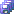

# Работа в настольном приложении

Работа в настольном приложении
-

# Работа в настольном приложении

В настольном приложении моделирование и прогнозирование выполняется
 в рамках [рабочей
 области](2_2_Window_container/uimodelling_workspace.htm).

Рабочая область - основная функциональная
 частью моделирования и прогнозирования, позволяющая создать и настроить
 взаимодействие объектов моделирования.

Порядок работы с моделированием и прогнозированием в настольном приложении:

	- [Запустите моделирование
	 и прогнозирование](../1_Modelling/Start_Modelling.htm).

	- [Создайте
	 модель и настройте её параметры](2_3_Work_object/2_3_2_Model/UiModelling_Model.htm).

	- [Создайте
	 метамодель и выстроите модели в требуемом порядке расчета](2_3_Work_object/2_3_3_MetaModel/uimodelling_metamodel.htm).

	- [Создайте
	 задачу моделирования и задайте параметры её расчета](2_3_Work_object/2_3_4_Problem/uimodelling_problem.htm).

	- [Создайте
	 сценарии моделирования и добавьте их в расчет задачи](2_3_Work_object/2_3_4_Problem/uimodelling_problem_3.htm).

	- [Рассчитайте
	 задачу моделирования](2_3_Work_object/2_3_4_Problem/uimodelling_problem_run.htm) и [выполните
	 анализ полученных данных](2_3_Work_object/2_3_4_Problem/uimodelling_problem_4.htm).

Для настройки параметров объектов моделирования используйте панели,
 расположенные в [рабочей
 области](2_2_Window_container/uimodelling_workspace.htm).

Для закрытия контейнера моделирования выполните команду «Выход»
 в главном меню «Контейнер моделирования».
 Контейнер моделирования будет закрыт, если в контейнере присутствуют несохраненные
 объекты, то их будет предложено сохранить.

## Основные операции с объектами в контейнере моделирования

[Создание
 объекта](javascript:TextPopup(this))

	Для создания объекта:

		- выполните команду, соответствующую типу создаваемого объекта:

			- в главном меню «Объект > Создать»;

			- в раскрывающемся меню «Создать»
			 на панели «[Объекты
			 контейнера](2_2_Window_container/uimodelling_window_object.htm)»;

		- нажмите кнопку, соответствующую типу создаваемого объекта
		 на панели «[Объекты
		 контейнера](2_2_Window_container/uimodelling_window_object.htm)».

	Новый объект будет создан в папке, выбранной на панели «[Объекты
	 контейнера](2_2_Window_container/uimodelling_window_object.htm)», и сразу отрыт на редактирование.

[Открытие
 объекта](javascript:TextPopup(this))

	Для открытия выделите требуемый объект на панели «[Объекты
	 контейнера](2_2_Window_container/uimodelling_window_object.htm)». Затем:

		- выполните команду «Редактировать»
		 в главном меню «Правка»
		 или в контекстном меню объекта на панели «[Объекты
		 контейнера](2_2_Window_container/uimodelling_window_object.htm)»;

		- нажмите кнопку 
		 на панели «[Объекты
		 контейнера](2_2_Window_container/uimodelling_window_object.htm)»;

		- нажмите клавишу F4;

		- дважды щёлкните по объекту.

	Выделенный объект будет открыт для редактирования в рабочей области.

[Сохранение
 объекта](javascript:TextPopup(this))

	Для сохранения активного объекта:

		- выполните команду «Сохранить»
		 в главном меню «Контейнер моделирования»;

		- нажмите кнопку  на панели
		 инструментов;

		- нажмите сочетание клавиш CTRL+S.

	Активный объект будет сохранен в текущем контейнере моделирования.

[Сохранение
 всех объектов](javascript:TextPopup(this))

	Для сохранения всех открытых объектов:

		- выполните команду «Сохранить
		 все» в главном меню «Контейнер
		 моделирования»;

		- нажмите кнопку  на панели
		 инструментов;

		- нажмите сочетание клавиш CTRL+SHIFT+S.

	Все открытые объекты будут сохранены в текущем контейнере моделирования.

[Создание
 копии объекта](javascript:TextPopup(this))

	Для создания копии активного объекта выполните команду «Сохранить как» в главном меню «Контейнер моделирования». Будет
	 отображен диалог для выбора места хранения копии объекта в текущем
	 контейнере моделирования. По умолчанию объект сохраняется со старым
	 именем и с автоматически сгенерированным идентификатором. Если необходимо,
	 то измените наименование и идентификатор объекта.

	Примечание.
	 Идентификатор объекта не должен содержать символы русского алфавита
	 и пробелы.

	Созданная копия сразу будет открыта на редактирование.

[Переименование
 объекта](javascript:TextPopup(this))

	Для переименования объекта без открытия его на редактирование:

		- Выделите объект на панели «[Объекты
		 контейнера](2_2_Window_container/uimodelling_window_object.htm)».

		- Щёлкните по наименованию объекта,
		 нажмите клавишу F2 или выполните команду «Переименовать» в
		 контекстном меню объекта или в главном меню «Правка».
		 Наименование объекта будет переведено в режим редактирования.

		- Введите требуемое наименование и нажмите клавишу ENTER или
		 щёлкните за пределами наименования объекта.

	Наименование объекта будет изменено.

	Если объект [открыт](#open) на редактирование, то для
	 изменения наименования используйте поле «Наименование»
	 на панели «Описание». Вид
	 панели зависит от типа объекта. После корректировки наименования [сохраните](#save) изменения.

[Удаление
 объекта](javascript:TextPopup(this))

	Для удаления выделите требуемый объект на панели «[Объекты
	 контейнера](2_2_Window_container/uimodelling_window_object.htm)». Затем:

		- выполните команду «Удалить»
		 в главном меню «Правка»
		 или в контекстном меню объекта на панели «[Объекты
		 контейнера](2_2_Window_container/uimodelling_window_object.htm)»;

		- нажмите кнопку 
		 на панели «[Объекты
		 контейнера](2_2_Window_container/uimodelling_window_object.htm)»;

		- нажмите клавишу DELETE.

	Объект будет удален с запросом подтверждения выполняемого действия.

	Объект не может быть удален, если от него зависят какие-либо другие
	 объекты в контейнере моделирования. Например, модель не может быть
	 удалена до тех пор, пока она входит в цепочку расчета метамодели.

	Совет. Для просмотра
	 зависимостей объекта используйте вкладки «[Состоит из](UiNav.chm::/03_Objects/UiNav_Obj_BasicPropConsist.htm)» и «[Входит в](UiNav.chm::/03_Objects/UiNav_Obj_BasicPropDependants.htm)» в диалоге
	 «[Свойства объекта](#prop)».

[Поиск
 объектов](javascript:TextPopup(this))

	Для поиска объектов в контейнере моделирования:

		- нажмите сочетание клавиш CTRL+F;

		- выполните команду «Найти»
		 в контекстном меню объекта на панели «[Объекты
		 контейнера](2_2_Window_container/uimodelling_window_object.htm)»;

		- выполните команду «Поиск»
		 в главном меню «Правка»;

		- нажмите кнопку 
		 на панели «[Объекты
		 контейнера](2_2_Window_container/uimodelling_window_object.htm)».

	Будет открыт диалог «[Поиск](UiNav.chm::/02_Navigator/UiNav_FindObject.htm)».

[Работа
 с буфером обмена](javascript:TextPopup(this))

	При работе с объектами контейнера моделирования доступна работа
	 с буфером обмена.

	Для копирования в буфер обмена объекта, выделенного на
	 панели «[Объекты
	 контейнера](2_2_Window_container/uimodelling_window_object.htm)»:

		- нажмите сочетание клавиш CTRL+C;

		- выполните команду «Копировать»
		 в контекстном меню объекта или в главном меню «Правка»;

		- нажмите кнопку  на панели
		 на панели инструментов.

	Копия объекта будет помещена в буфер обмена.

	Для перемещения в буфер обмена объекта, выделенного на панели «[Объекты
	 контейнера](2_2_Window_container/uimodelling_window_object.htm)»:

		- нажмите сочетание клавиш CTRL+X;

		- выполните команду «Вырезать»
		 в контекстном меню объекта или в главном меню «Правка»;

		- нажмите кнопку  на панели
		 на панели инструментов.

	Объект будет перемещен в буфер обмена.

	Для вставки объектов из буфера обмена:

		- нажмите сочетание клавиш CTRL+V;

		- выполните команду «Вставить» в
		 контекстном меню объекта или в главном меню «Правка»;

		- нажмите кнопку  на панели
		 на панели инструментов.

	Объект будет вставлен в место, выделенное на панели «[Объекты
	 контейнера](2_2_Window_container/uimodelling_window_object.htm)».

[Просмотр
 базовых свойств объекта](javascript:TextPopup(this))

	Для просмотра базовых свойств объекта, выделенного на панели «[Объекты
	 контейнера](2_2_Window_container/uimodelling_window_object.htm)»:

		- выполните команду «Свойства»
		 в главном меню «Объект»
		 или в контекстном меню объекта на панели «[Объекты
		 контейнера](2_2_Window_container/uimodelling_window_object.htm)»;

		- нажмите кнопку 
		 на панели инструментов.

	Будет открыт диалог «[Свойства
	 объекта](UiNav.chm::/03_Objects/UiNav_Obj_BasicProp.htm)».

См. также:

[Создание
 контейнера моделирования](2_1_Create_Cont_Modeling/UiModelling_Create_Container.htm) | [Пример создания цепочки
 расчета](../Example/UiModelling_Example.htm)

		Справочная
		 система на версию 10.9
		 от 18/08/2025,
		 © ООО «ФОРСАЙТ»,
