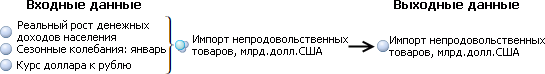
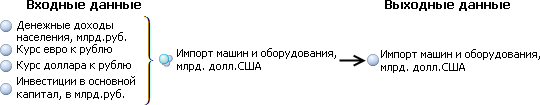
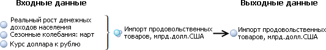
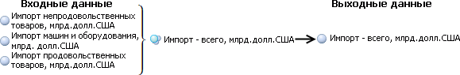
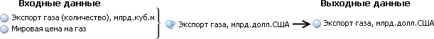
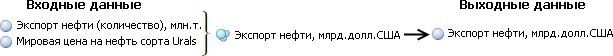
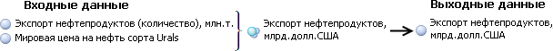
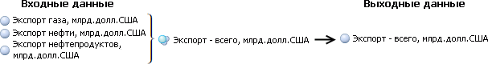
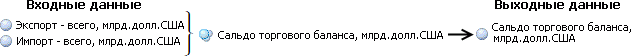

# Пример создания цепочки расчета

Пример создания цепочки расчета
-

# Пример создания цепочки расчета

В данном примере описано создание в настольном приложении цепочки расчета,
 моделирующей сальдо торгового баланса РФ.

Сальдо торгового баланса - это разность суммарного экспорта и суммарного
 импорта.

Суммарный экспорт складывается из трех основных составляющих: экспорт
 нефтепродуктов, экспорт нефти и экспорт газа. Каждая составляющая высчитывается
 как произведение физического объема экспорта и мировой цены. Прочие составляющие
 экспорта учитываются в уравнении модели расчета суммарного экспорта.

Суммарный импорт включает в себя следующие основные составляющие: импорт
 непродовольственных товаров, импорт продовольственных товаров и импорт
 машин и оборудования. Каждая основная составляющая импорта моделируются
 исходя из курсов валют, доходов населения и инвестиций в основной капитал.
 Прочие составляющие учитываются в уравнении модели расчета суммарного
 импорта.

Таким образом, для цепочки расчета необходимы следующие модели:

	- Модель «Импорт непродовольственных
	 товаров, млрд.долл.США» - рассчитывает стоимость импорта непродовольственных
	 товаров в млрд.долл.США исходя из реального роста денежных доходов
	 населения, курса доллара к рублю и сезонных колебаний. Выгружает результаты
	 в переменную «Импорт непродовольственных
	 товаров, млрд.долл.США».

	- Модель «Импорт машин и оборудования,
	 млрд.долл.США» - рассчитывает стоимость импорта машин и оборудования
	 в млрд.долл.США исходя из денежных доходов населения, курса евро к
	 рублю, курса доллара к рублю и инвестиций в основной капитал. Выгружает
	 результаты в переменную «Импорт машин
	 и оборудования, млрд.долл.США».

	- Модель «Импорт продовольственных
	 товаров, млрд.долл.США» - рассчитывает стоимость импорта продовольственных
	 товаров в млрд.долл.США исходя из реального роста денежных доходов
	 населения, курса доллара к рублю и сезонных колебаний. Выгружает результаты
	 в переменную «Импорт продовольственных
	 товаров, млрд.долл.США».

	- Модель «Импорт - всего, млрд.долл.США»
	 - рассчитывает суммарный импорт по значениям переменных «Импорт
	 непродовольственных товаров, млрд.долл.США», «Импорт
	 машин и оборудования, млрд.долл.США» и «Импорт
	 продовольственных товаров, млрд.долл.США». Выгружает результаты
	 в переменную «Импорт - всего млрд.долл.США».

	- Модель «Экспорт газа, млрд.долл.США»
	 - рассчитывает стоимость экспорта газа в млрд.долл.США исходя из мировой
	 цены и количества экспортированного газа. Выгружает результаты в переменную
	 «Экспорт газа, млрд.долл.США».

	- Модель «Экспорт нефти, млрд.долл.США»
	 - рассчитывает стоимость экспорта нефти в млрд.долл.США исходя из
	 мировой цены и количества экспортированной нефти. Выгружает результаты
	 в переменную «Экспорт нефти, млрд.долл.США».

	- Модель «Экспорт нефтепродуктов,
	 млрд.долл.США» - рассчитывает стоимость экспорта нефтепродуктов
	 в млрд.долл.США исходя из мировой цены и количества экспортированных
	 нефтепродуктов. Выгружает результаты в переменную «Экспорт
	 нефтепродуктов, млрд.долл.США».

	- Модель «Экспорт - всего, млрд.долл.США»
	 - рассчитывает суммарный экспорт по значениям переменных «Экспорт
	 газа, млрд.долл.США», «Экспорт
	 нефти, млрд.долл.США» и «Экспорт
	 нефтепродуктов, млрд.долл.США». Выгружает результаты в переменную
	 «Экспорт - всего, млрд.долл.США».

	- Модель «Сальдо торгового баланса,
	 млрд.долл.США» - рассчитывает сальдо торгового баланса по значениям
	 переменных «Экспорт - всего, млрд.долл.США»
	 и «Импорт - всего млрд.долл.США».
	 Выгружает результаты в переменную «Сальдо
	 торгового баланса, млрд.долл.США».

В моделировании и прогнозировании цепочка расчета может быть создана
 как в [режиме работы](../1_Modelling/Start_Modelling.htm) на
 атрибутах, так и в режиме работы на переменных.

Создание цепочки расчета требует выполнения следующих этапов:

	- [Создание переменных](UiModelling_Expl_1_Vars_Create.htm).

	- [Создание моделей](UiModelling_Expl_2_Vars_Model.htm).

	- [Создание метамодели](UiModelling_Expl_3_MetaModel.htm).

	- [Создание задачи моделирования
	 и сценария расчета](UiModelling_Expl_4_Problem.htm).

См. также:

[Процесс моделирования](../2_Container_of_Modeling/Modelling_process.htm)

		Справочная
		 система на версию 10.9
		 от 18/08/2025,
		 © ООО «ФОРСАЙТ»,
