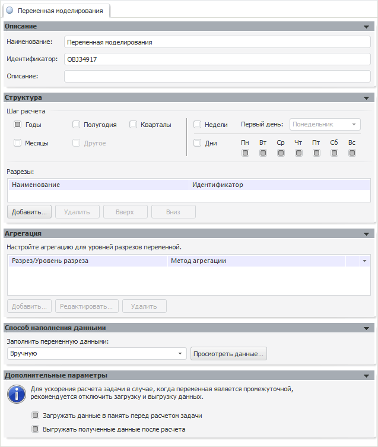
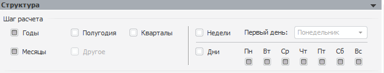
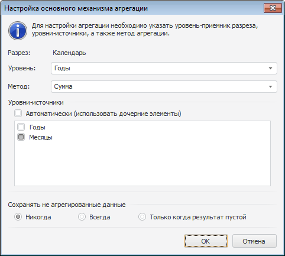

# Создание переменных: пример моделирования (настольное приложение)

Создание переменных: пример моделирования (настольное приложение)
-

# Создание переменных

Для создания моделей в цепочке расчета необходимы:

[Переменные,
 содержащие исходные данные](javascript:TextPopup(this))

		- Реальный рост денежных доходов населения.

		- Сезонные колебания: январь.

		- Сезонные колебания: март.

		- Курс доллара к рублю.

		- Курс евро к рублю.

		- Денежные доходы населения, млрд.руб.

		- Инвестиции в основной капитал, в млрд.руб.

		- Экспорт газа (количество), млрд.куб.м.

		- Экспорт нефтепродуктов (количество), млн.т.

		- Экспорт нефти (количество), млн.т.

		- Мировая цена на газ.

		- Мировая цена на нефть сорта Urals.

[Переменные,
 содержащие промежуточные результаты расчетов](javascript:TextPopup(this))

		- Экспорт газа, млрд.долл.США.

		- Экспорт нефтепродуктов, млрд.долл.США.

		- Экспорт нефти, млрд.долл.США.

		- Экспорт - всего, млрд.долл.США.

		- Импорт машин и оборудования, млрд.долл.США.

		- Импорт непродовольственных товаров, млрд.долл.

		- Импорт продовольственных товаров, млрд.долл.

		- Импорт - всего, млрд.долл.США.

[Переменные,
 содержащие итоговые данные](javascript:TextPopup(this))

		- Сальдо торгового баланса, млрд.долл.США.

## Создание переменных в режиме на атрибутах

Если моделирование и прогнозирование работает в [режиме
 на атрибутах](../1_Modelling/Start_Modelling.htm), то создание переменных выполняется вне контейнера моделирования.
 В качестве источника данных будет использоваться база данных временных
 рядов.

Для создания переменных:

	- [Создайте](UiNavObj.chm::/reference_book/Master_RDS_reference_book/Master_RDS.htm)
	 справочник НСИ.

	- В созданный справочник [добавьте
	 элементы](UiNavObj.chm::/reference_book/Work/Work_Elements.htm#addelement) с наименованиями, соответствующим переменным,
	 которые перечислены выше.

	- Создайте [базу
	 данных временных рядов](UiNavObj.chm::/TimeSeriesDatabase/CreateTimeSeriesDatabase.htm) с наименованием «Переменные».

	- В созданную базу данных временных рядов добавьте [обязательный
	 атрибут](UiNavObj.chm::/TimeSeriesDatabase/TS_Attributes.htm#addattr), являющийся ссылкой на созданный справочник
	 НСИ.

## Создание переменных в режиме на переменных

Если моделирование и прогнозирование работает в [режиме
 на переменных](../1_Modelling/Start_Modelling.htm), то создание переменных выполняется в контейнере моделирования.

Для создания переменной:

	- нажмите кнопку  на панели «[Объекты контейнера](../2_Container_of_Modeling/2_2_Window_container/uimodelling_window_object.htm)»;

	- выполните команду главного меню «Объект
	 > Создать >Переменная»;

	- выполните команду «Создать
	 > Переменная» в контекстном меню панели «[Объекты контейнера](../2_Container_of_Modeling/2_2_Window_container/uimodelling_window_object.htm)».

В рабочей области будут открыты панели, позволяющие редактировать параметры
 переменной:

На панели «[Описание](../2_Container_of_Modeling/2_3_Work_object/2_3_1_Value/uimodelling_work_object_value_1.htm)» в поле «Наименование» задайте наименование
 переменной и при необходимости изменить идентификатор (поле «Идентификатор»)
 или описание переменной (поле «Описание»).

Поскольку в рассматриваемом примере исходными являются месячные данные,
 а результатом должны быть годовые, то для каждой создаваемой переменной
 на панели «[Структура](../2_Container_of_Modeling/2_3_Work_object/2_3_1_Value/UiModelling_Work_object_Value_2.htm)» отметьте флажками
 динамики: «Годы» и «Месяцы».

Необходимо настроить агрегацию уровней переменной для получения годовых
 данных из месячных. На панели «[Агрегация](../2_Container_of_Modeling/2_3_Work_object/2_3_1_Value/UiModelling_Work_object_Value_3.htm)»
 нажмите кнопку «Добавить». Будет
 открыто окно для редактирования параметров агрегации:

В раскрывающемся списке «Уровень»
 выберите «Годы», в раскрывающемся
 списке «Метод» - «Сумма».
 Снимите флажок «Автоматически (использовать
 дочерние элементы)» и установите флажок «Месяцы».
 Таким образом, будет настроена агрегация данных с месячной динамики на
 годовую.

Примечание.
 Также могут быть использованы и другие методы агрегации. Например, для
 переменных, содержащих исходные данные по ценам («Мировая
 цена на газ» и «Мировая цена на
 нефть сорта Urals»), в качестве метода агрегации укажите «Фактическое среднее».

После настройки всех параметров переменной ее следует сохранить. Для
 этого:

	- нажмите кнопку  на панели инструментов;

	- выполните команду главного меню «Контейнер
	 моделирования > Сохранить».

Подобным образом создайте все переменные, необходимые для моделирования.
 Следующим этапом в создании цепочки расчета является [создание
 моделей](UiModelling_Expl_2_Vars_Model.htm).

См. также:

[Пример создания цепочки расчета](UiModelling_Example.htm)
 | [Объект
 «Переменная»](../2_Container_of_Modeling/2_3_Work_object/2_3_1_Value/uimodelling_work_object_value.htm)

		Справочная
		 система на версию 10.9
		 от 18/08/2025,
		 © ООО «ФОРСАЙТ»,
