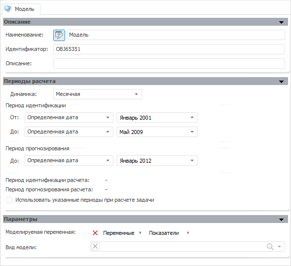

# Создание моделей

Создание моделей
-

# Создание моделей

После [создания переменных](UiModelling_Expl_1_Vars_Create.htm)
 последовательно создайте следующие модели:

	- Импорт непродовольственных товаров, млрд.долл.США;

	- Импорт машин и оборудования, млрд.долл.США;

	- Импорт продовольственных товаров, млрд.долл.США;

	- Импорт - всего, млрд.долл.США;

	- Экспорт газа, млрд.долл.США;

	- Экспорт нефти, млрд.долл.США;

	- Экспорт нефтепродуктов, млрд.долл.США;

	- Экспорт - всего, млрд.долл.США;

	- Сальдо торгового баланса, млрд.долл.США.

Для создания модели:

	- нажмите кнопку  на панели «[Объекты контейнера](../2_Container_of_Modeling/2_2_Window_container/uimodelling_window_object.htm)»;

	- выполните команду главного меню «Объект
	 > Создать > Модель»;

	- выполните команду «Создать
	 > Модель» в контекстном меню панели «[Объекты
	 контейнера](../2_Container_of_Modeling/2_2_Window_container/uimodelling_window_object.htm)».

Будут открыты панели, позволяющие редактировать параметры модели:

На панели «[Описание](../2_Container_of_Modeling/2_3_Work_object/2_3_2_Model/Standart_Model/UiModelling_Model_1.htm)» в поле «Наименование» введите наименование
 переменной и при необходимости измените идентификатор (поле «Идентификатор»)
 или описание модели (поле «Описание»).

На панели «[Периоды расчета](../2_Container_of_Modeling/2_3_Work_object/2_3_2_Model/Standart_Model/UiModelling_Model_2.htm)» задайте
 календарные параметры расчета модели. Для всех создаваемых моделей укажите
 одни и те же календарные параметры: динамика - месячная; период идентификации
 - с января 2001г. по май 2009г.; период прогнозирования - по январь
 2012г.

На панели «[Параметры](../2_Container_of_Modeling/2_3_Work_object/2_3_2_Model/Standart_Model/uimodelling_model_3.htm)» укажите вид
 модели и моделируемую переменную. В режиме [работы
 на атрибутах](../1_Modelling/Start_Modelling.htm) в качестве источника данных моделируемой переменной выберите
 созданную базу данных временных рядов «Переменные».
 После выбора вида модели будут отображены дополнительные панели, позволяющие
 задать параметры расчета модели.

После определения всех параметров модели ее следует сохранить. Для этого:

	- нажмите кнопку  на панели инструментов;

	- выполните команду главного меню «Контейнер
	 моделирования > Сохранить».

После создания всех моделей следующим этапом в создании цепочки расчета
 является [создание метамодели](UiModelling_Expl_3_MetaModel.htm).

## Описание параметров моделей

[Параметры модели
 «Импорт непродовольственных товаров, млрд.долл.США»](javascript:TextPopup(this))

		- На панели «Описание»
		 введите наименование - «Импорт
		 непродовольственных товаров, млрд.долл.США».

		- На панели «Параметры»
		 в качестве моделируемой укажите переменную «Импорт
		 непродовольственных товаров, млрд.долл.», вид модели -
		 [Линейная
		 регрессия (оценка МНК)](../2_Container_of_Modeling/2_3_Work_object/2_3_2_Model/Specification/8_Linear_regression/uimodelling_model_specification_linaer_reg.htm). Будет отображена панель «Спецификация»
		 и ряд других панелей.

		- На панели «Спецификация»:

			- В раскрывающемся списке «[Преобразование
			 моделируемой переменной](../2_Container_of_Modeling/2_3_Work_object/UiModelling_work_Changes.htm)» укажите: темп прироста pch PoP.

			- В список «Факторы»
			 [добавьте
			 переменные](../2_Container_of_Modeling/2_3_Work_object/2_3_2_Model/Standart_Model/UiModelling_Model_Factor_work.htm#factoradd), содержащие исходные данные: «Реальный
			 рост денежных доходов населения», «Курс
			 доллара к рублю», «Сезонные
			 колебания: январь». Для добавления переменной нажмите
			 кнопку «Добавить».

			- В группе параметров «Константа»
			 установите переключатель «Оценить».

			- Установите флажок «Установить
			 порядок авторегрессии».

[Параметры модели
 «Импорт машин и оборудования, млрд.долл.США»](javascript:TextPopup(this))

		- На панели «Описание»
		 введите наименование - «Импорт
		 машин и оборудования, млрд.долл.США».

		- На панели «Параметры»
		 в качестве моделируемой укажите переменную «Импорт
		 машин и оборудования, млрд.долл.США», вид модели - [Линейная
		 регрессия (оценка МНК)](../2_Container_of_Modeling/2_3_Work_object/2_3_2_Model/Specification/8_Linear_regression/uimodelling_model_specification_linaer_reg.htm). Будет отображена панель «Спецификация»
		 и ряд других панелей.

		- На панели «Спецификация»:

			- В раскрывающемся списке «[Преобразование
			 моделируемой переменной](../2_Container_of_Modeling/2_3_Work_object/UiModelling_work_Changes.htm)» укажите: темп прироста pch PoP.

			- В список «Факторы»
			 [добавьте
			 переменные](../2_Container_of_Modeling/2_3_Work_object/2_3_2_Model/Standart_Model/UiModelling_Model_Factor_work.htm#factoradd), содержащие исходные данные: «Курс
			 доллара к рублю», «Курс
			 евро к рублю», «Денежные
			 доходы населения, млрд.руб.» и «Инвестиции
			 в основной капитал, в млрд.руб.». Для добавления переменной
			 нажмите кнопку «Добавить».

			- Для каждого добавленного фактора выберите пункт «Преобразование»
			 и в отобразившемся меню выберите [преобразование](../2_Container_of_Modeling/2_3_Work_object/UiModelling_work_Changes.htm):
			 темп прироста pch YoY.

			- В группе параметров «Константа»
			 установите переключатель «Оценить».

			- Установите флажок «Установить
			 порядок авторегрессии».

[Параметры модели
 «Импорт продовольственных товаров, млрд.долл.США»](javascript:TextPopup(this))

		- На панели «Описание»
		 введите наименование - «Импорт
		 продовольственных товаров, млрд.долл.США».

		- На панели «Параметры»
		 в качестве моделируемой укажите переменную «Импорт
		 продовольственных товаров, млрд.долл.США.», вид модели
		 - [Линейная
		 регрессия (оценка МНК)](../2_Container_of_Modeling/2_3_Work_object/2_3_2_Model/Specification/8_Linear_regression/uimodelling_model_specification_linaer_reg.htm). Будет отображена панель «Спецификация»
		 и ряд других панелей.

		- На панели «Спецификация»:

			- В раскрывающемся списке «[Преобразование
			 моделируемой переменной](../2_Container_of_Modeling/2_3_Work_object/UiModelling_work_Changes.htm)» укажите: темп прироста pch PoP.

			- В список «Факторы»
			 [добавьте
			 переменные](../2_Container_of_Modeling/2_3_Work_object/2_3_2_Model/Standart_Model/UiModelling_Model_Factor_work.htm#factoradd), содержащие исходные данные: «Реальный
			 рост денежных доходов населения», «Курс
			 доллара к рублю», «Сезонные
			 колебания: март». Для добавления переменной нажмите
			 кнопку «Добавить».

			- В группе параметров «Константа»
			 установите переключатель «Оценить».

			- Установите флажок «Установить
			 порядок авторегрессии».

[Параметры модели
 «Импорт - всего, млрд.долл.США»](javascript:TextPopup(this))

		- На панели «Описание»
		 введите наименование - «Импорт
		 - всего, млрд.долл.США».

		- На панели «Параметры»
		 в качестве моделируемой укажите переменную «Импорт
		 - всего, млрд.долл.США», вид модели - [Линейная
		 регрессия (оценка МНК)](../2_Container_of_Modeling/2_3_Work_object/2_3_2_Model/Specification/8_Linear_regression/uimodelling_model_specification_linaer_reg.htm). Будет отображена панель «Спецификация»
		 и ряд других панелей.

		- На панели «Спецификация»:

			- В список «Факторы»
			 [добавьте
			 переменную](../2_Container_of_Modeling/2_3_Work_object/2_3_2_Model/Standart_Model/UiModelling_Model_Factor_work.htm#factoradd), содержащую исходные данные: «Импорт
			 машин и оборудования, млрд.долл.США». Для добавления
			 переменной нажмите кнопку «Добавить».

			- Выберите в списке «Факторы»
			 добавленную переменную и нажмите кнопку «Редактировать».
			 В открывшемся [редакторе
			 выражения](UiNav.Chm::/GUI/ExpressionEditor.htm) составьте формулу:

	{Импорт машин и оборудования,
	 млрд.долл.США[t]}+{Импорт непродовольственных товаров, млрд.долл.[t]}+{Импорт
	 продовольственных товаров, млрд.долл.[t]}

			- Закройте [редактор
			 выражения](UiNav.Chm::/GUI/ExpressionEditor.htm).

			- В группе параметров «Константа»
			 установите переключатель «Оценить».

[Параметры модели
 «Экспорт газа, млрд.долл.США»](javascript:TextPopup(this))

		- На панели «Описание»
		 введите наименование - «Экспорт
		 газа, млрд.долл.США».

		- На панели «Параметры»
		 в качестве моделируемой укажите переменную «Экспорт
		 газа, млрд.долл.США», вид модели - [Линейная
		 регрессия (оценка МНК)](../2_Container_of_Modeling/2_3_Work_object/2_3_2_Model/Specification/8_Linear_regression/uimodelling_model_specification_linaer_reg.htm). Будет отображена панель «Спецификация»
		 и ряд других панелей.

		- На панели «Спецификация»:

			- В список «Факторы»
			 [добавьте
			 переменную](../2_Container_of_Modeling/2_3_Work_object/2_3_2_Model/Standart_Model/UiModelling_Model_Factor_work.htm#factoradd), содержащую исходные данные: «Экспорт
			 газа (количество), млрд.куб.м». Для добавления
			 переменной нажмите кнопку «Добавить».

			- Выберите в списке «Факторы»
			 добавленную переменную и нажмите кнопку «Редактировать».
			 В открывшемся [редакторе
			 выражения](UiNav.Chm::/GUI/ExpressionEditor.htm) составьте формулу:

	{Экспорт газа (количество),
	 млрд.куб.м.[t]}*{Мировая цена на газ[t]}

			- Закройте [редактор
			 выражения](UiNav.Chm::/GUI/ExpressionEditor.htm).

			- В группе параметров «Константа»
			 установите переключатель «Оценить».

[Параметры модели
 «Экспорт нефти, млрд.долл.США»](javascript:TextPopup(this))

		- На панели «Описание»
		 введите наименование - «Экспорт
		 нефти, млрд.долл.США».

		- На панели «Параметры»
		 в качестве моделируемой укажите переменную «Экспорт
		 нефти, млрд.долл.США», вид модели - [Линейная
		 регрессия (оценка МНК)](../2_Container_of_Modeling/2_3_Work_object/2_3_2_Model/Specification/8_Linear_regression/uimodelling_model_specification_linaer_reg.htm). Будет отображена панель «Спецификация»
		 и ряд других панелей.

		- На панели «Спецификация»:

			- В список «Факторы»
			 [добавьте
			 переменную](../2_Container_of_Modeling/2_3_Work_object/2_3_2_Model/Standart_Model/UiModelling_Model_Factor_work.htm#factoradd), содержащую исходные данные: «Экспорт
			 нефти (количество), млн.т.». Для добавления переменной
			 нажмите кнопку «Добавить».

			- Выберите в списке «Факторы»
			 добавленную переменную и нажмите кнопку «Редактировать».
			 В открывшемся [редакторе
			 выражения](UiNav.Chm::/GUI/ExpressionEditor.htm) составьте формулу:

	{Экспорт нефти (количество),
	 млн.т.[t]}*{Мировая цена на нефть сорта Urals[t]}

			- Закройте [редактор
			 выражения](UiNav.Chm::/GUI/ExpressionEditor.htm).

			- В группе параметров «Константа»
			 установите переключатель «Оценить».

[Параметры модели
 «Экспорт нефтепродуктов, млрд.долл.США»](javascript:TextPopup(this))

		- На панели «Описание»
		 введите наименование - «Экспорт
		 нефтепродуктов, млрд.долл.США».

		- На панели «Параметры»
		 в качестве моделируемой укажите переменную «Экспорт
		 нефтепродуктов, млрд.долл.США», вид модели - [Линейная
		 регрессия (оценка МНК)](../2_Container_of_Modeling/2_3_Work_object/2_3_2_Model/Specification/8_Linear_regression/uimodelling_model_specification_linaer_reg.htm). Будет отображена панель «Спецификация»
		 и ряд других панелей.

		- На панели «Спецификация»:

			- В список «Факторы»
			 [добавьте
			 переменную](../2_Container_of_Modeling/2_3_Work_object/2_3_2_Model/Standart_Model/UiModelling_Model_Factor_work.htm#factoradd), содержащую исходные данные: «Экспорт
			 нефтепродуктов (количество), млн.т.». Для добавления
			 переменной нажмите кнопку «Добавить».

			- Выберите в списке «Факторы»
			 добавленную переменную и нажмите кнопку «Редактировать».
			 В открывшемся [редакторе
			 выражения](UiNav.Chm::/GUI/ExpressionEditor.htm) составьте формулу:

	{Экспорт нефтепродуктов
	 (количество), млн.т.[t]}*{Мировая цена на нефть сорта Urals[t]}

			- Закройте [редактор
			 выражения](UiNav.Chm::/GUI/ExpressionEditor.htm).

			- В группе параметров «Константа»
			 установите переключатель «Оценить».

[Параметры модели
 «Экспорт - всего, млрд.долл.США»](javascript:TextPopup(this))

		- На панели «Описание»
		 введите наименование - «Экспорт
		 - всего, млрд.долл.США».

		- На панели «Параметры»
		 в качестве моделируемой укажите переменную «Экспорт
		 - всего, млрд.долл.США», вид модели - [Линейная
		 регрессия (оценка МНК)](../2_Container_of_Modeling/2_3_Work_object/2_3_2_Model/Specification/8_Linear_regression/uimodelling_model_specification_linaer_reg.htm). Будет отображена панель «Спецификация»
		 и ряд других панелей.

		- На панели «Спецификация»:

			- В список «Факторы»
			 [добавьте
			 переменную](../2_Container_of_Modeling/2_3_Work_object/2_3_2_Model/Standart_Model/UiModelling_Model_Factor_work.htm#factoradd), содержащую исходные данные: «Экспорт
			 газа, млрд.долл.США». Для добавления переменной нажмите
			 кнопку «Добавить».

			- Выберите в списке «Факторы»
			 добавленную переменную и нажмите кнопку «Редактировать».
			 В открывшемся [редакторе
			 выражения](UiNav.Chm::/GUI/ExpressionEditor.htm) составьте формулу:

	{Экспорт
	 газа, млрд.долл.США[t]}+{Экспорт нефтепродуктов, млрд.долл.США[t]}+{Экспорт
	 нефти, млрд.долл.США[t]}

			- Закройте [редактор
			 выражения](UiNav.Chm::/GUI/ExpressionEditor.htm).

			- В группе параметров «Константа»
			 установите переключатель «Оценить».

[Параметры модели
 «Сальдо торгового баланса, млрд.долл.США»](javascript:TextPopup(this))

		- На панели «Описание»
		 введите наименование - «Сальдо
		 торгового баланса, млрд.долл.США».

		- На панели «Параметры»
		 в качестве моделируемой укажите переменную «Сальдо
		 торгового баланса, млрд.долл.США», вид модели - [Детерминированное
		 уравнение](../2_Container_of_Modeling/2_3_Work_object/2_3_2_Model/Specification/4_Deterministic_equation/uimodelling_model_specification_deter.htm). Будет отображена панель «Спецификация»
		 и ряд других панелей.

		- На панели «Спецификация»:

			- В список «Факторы»
			 [добавьте
			 переменные](../2_Container_of_Modeling/2_3_Work_object/2_3_2_Model/Standart_Model/UiModelling_Model_Factor_work.htm#factoradd), содержащие исходные данные: «Экспорт
			 - всего, млрд.долл.США» и «Импорт
			 - всего, млрд.долл.США». Для добавления переменной
			 нажмите кнопку «Добавить».

			- В поле «Y=»
			 составьте формулу для вычисления сальдо торгового баланса:

	{Экспорт - всего,
	 млрд.долл.США[t]} - {Импорт - всего, млрд.долл.США[t]}

См. также:

[Пример создания цепочки расчета](UiModelling_Example.htm)
 | [Объект
 «Модель»](../2_Container_of_Modeling/2_3_Work_object/2_3_2_Model/UiModelling_Model.htm)

		Справочная
		 система на версию 10.9
		 от 18/08/2025,
		 © ООО «ФОРСАЙТ»,
