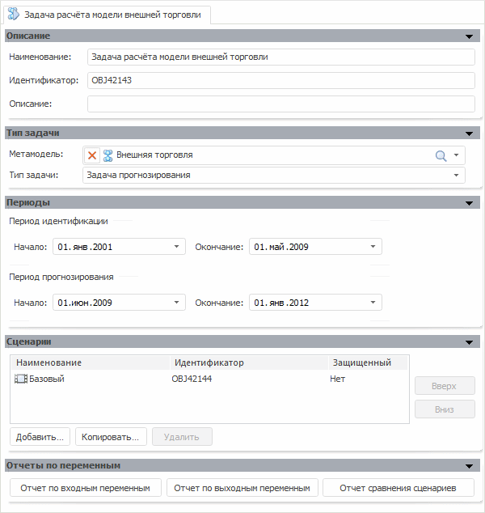

# Создание задачи моделирования и сценария расчета

Создание задачи моделирования и сценария расчета
-

# Создание задачи моделирования и сценария расчета

После [создания метамодели](UiModelling_Expl_3_MetaModel.htm)
 создайте задачу моделирования, с помощью которой будет осуществлен расчет
 цепочки.

Для создания задачи моделирования:

	- нажмите кнопку  на панели «[Объекты контейнера](../2_Container_of_Modeling/2_2_Window_container/uimodelling_window_object.htm)»;

	- выполните команду главного меню «Объект
	 > Создать > Задача»;

	- выполните команду «Создать
	 > Задача» в контекстном меню панели «[Объекты
	 контейнера](../2_Container_of_Modeling/2_2_Window_container/uimodelling_window_object.htm)».

В рабочей области будут открыты панели для редактирования параметров
 создаваемой задачи.

Для задачи укажите параметры:

	- На панели «[Тип
	 задачи](../2_Container_of_Modeling/2_3_Work_object/2_3_4_Problem/uimodelling_problem_2.htm)»:

	-

		- метамодель: Внешняя торговля;

		- тип задачи: Задача прогнозирования.

	- На панели «[Периоды](../2_Container_of_Modeling/2_3_Work_object/2_3_4_Problem/uimodelling_problem_5.htm)»:

	-

		- начало периода идентификации: 01.01.2001;

		- окончание периода идентификации: 01.05.2009;

		- начало периода прогнозирования: 01.06.2009;

		- окончание периода прогнозирования: 01.06.2012.

Создайте новый [сценарий
 моделирования](../2_Container_of_Modeling/2_2_Window_container/Scenario_Of_Modeling.htm): нажмите кнопку 
 на панели инструментов. Будет открыт диалог настройки параметров сценария.
 В данном диалоге необходимо указать наименование создаваемого сценария:

Для добавления созданного сценария в задачу моделирования перетащите
 его из панели «[Сценарии моделирования](../2_Container_of_Modeling/2_2_Window_container/Scenario_Of_Modeling.htm)»
 на панель «[Сценарии](../2_Container_of_Modeling/2_3_Work_object/2_3_4_Problem/uimodelling_problem_3.htm)».

Сохраните задачу:

	- нажмите кнопку 
	 на панели инструментов;

	- выполните команду главного меню «Контейнер
	 моделирования > Сохранить».

## Наполнение переменных данными

Для получения результатов необходимо, чтобы все входные и выходные переменные,
 используемые в задаче, содержали данные на требуемый период по всем сценариям.

[Входные переменные](javascript:TextPopup(this))

		- Сезонные колебания: январь.

		- Курс евро к рублю.

		- Денежные доходы населения, млрд.руб.

		- Инвестиции в основной капитал, в млрд.руб.

		- Сезонные колебания: март.

		- Экспорт газа (количество), млрд.куб.м.

		- Мировая цена на газ.

		- Экспорт нефти (количество), млн.т.

		- Мировая цена на нефть сорта Urals.

		- Импорт продовольственных товаров, млрд.долл.США.

[Выходные переменные](javascript:TextPopup(this))

		- Экспорт нефтепродуктов, млрд.долл.США.

		- Экспорт газа, млрд.долл.США.

		- Экспорт нефти, млрд.долл.США.

		- Импорт машин и оборудования, млрд.долл.США.

		- Импорт непродовольственных товаров, млрд.долл.США.

		- Экспорт - всего, млрд.долл.США.

		- Импорт - всего, млрд.долл.США.

		- Сальдо торгового баланса, млрд.долл.США.

Для наполнения переменных данными:

	- Перейдите на вкладку «[Отчеты
	 по переменным](../2_Container_of_Modeling/2_3_Work_object/2_3_4_Problem/uimodelling_problem_4.htm)».

	- Нажмите кнопку «Отчет по входным
	 переменным». Будет открыт экспресс-отчет, содержащий данные
	 всех входных переменных.

	- Задайте данные всех входных переменных на период прогнозирования
	 по всем сценариям. Сохраните данные и закройте экспресс-отчет.

	- Нажмите кнопку «Отчет по выходным
	 переменным». Будет открыт экспресс-отчет, содержащий данные
	 всех выходных переменных.

	- Задайте данные всех выходных переменных на период идентификации
	 по всем сценариям. Сохраните данные и закройте экспресс-отчет.

После этого можно приступить к расчету задачи.

Совет. Если моделирование
 и прогнозирование работает в режиме на переменных, то для наполнения данными
 переменных можно дополнительно использовать панель «[Способ
 наполнения данными](../2_Container_of_Modeling/2_3_Work_object/2_3_1_Value/UiModelling_Work_object_Value_4.htm)». На данной панели укажите метод передачи данных
 из источника в переменную: [вручную](../2_Container_of_Modeling/2_3_Work_object/2_3_1_Value/uimodelling_work_object_value_4_3.htm),
 [по
 формуле](../2_Container_of_Modeling/2_3_Work_object/2_3_1_Value/UiModelling_Work_object_Value_4_2.htm) или [из
 источника](../2_Container_of_Modeling/2_3_Work_object/2_3_1_Value/uimodelling_work_object_value_4_1.htm), затем выполните загрузку данных.

## Расчет задачи

Для расчета задачи нажмите кнопку  на панели инструментов
 или выполните команду «Рассчитать»
 в контекстном меню панели «[Объекты
 контейнера](../2_Container_of_Modeling/2_2_Window_container/uimodelling_window_object.htm)». Будет открыто окно «[Расчет
 задачи](../2_Container_of_Modeling/2_3_Work_object/2_3_4_Problem/uimodelling_problem_run.htm)», в котором необходимо установить флажки для сценариев
 «Факт» и «Базовый».

Для расчета задачи нажмите кнопку «Запустить».

Задача будет рассчитана по сценариям «Факт»
 и «Базовый». После окончания
 расчета окончательные результаты будут выгружены в переменную «Сальдо
 торгового баланса, млрд.долл.США».

См. также:

[Пример создания цепочки расчета](UiModelling_Example.htm)
 | [Объект
 «Задача»](../2_Container_of_Modeling/2_3_Work_object/2_3_4_Problem/uimodelling_problem.htm)

		Справочная
		 система на версию 10.9
		 от 18/08/2025,
		 © ООО «ФОРСАЙТ»,
