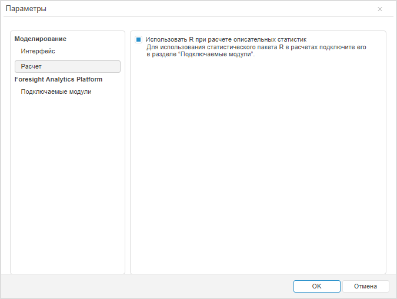

# Как настроить интеграцию с R?

Как настроить интеграцию с R?
-

# Как настроить интеграцию с R?

В инструменте «Моделирование и прогнозировние»
 доступна интеграция с пакетом R, расширяющим аналитические возможности
 инструмента.

Более подробная информация об R приведена в [документации
 к R](http://cran.r-project.org/manuals.html).

## Решение

Для получения подробного описания процесса интеграции продукта «Форсайт. Аналитическая платформа»
 с пакетом R обратитесь к статье «[Подключение дополнительных модулей к «Форсайт. Аналитическая платформа](uinav.chm::/02_Navigator/CommonSettings/Integration.htm#r)».

После выполнения интеграции в инструменте «Моделирование
 и прогнозирование» с помощью R можно рассчитывать модели и уравнения.
 Для расчёта [описательных
 статистик](../Web/Work/Varables/Var_DescrStat.htm) с помощью R:

Примечание.
 Возможность доступна только в [веб-приложении](../Web/WebApplication.htm).

	- В веб-приложении в главном меню инструмента «Моделирование
	 и прогнозирование» выполните команду «Сервис
	 > Параметры». Будет открыт диалог «Параметры».

	Команда доступна, если в рабочей области открыта какая-либо [модель](../Web/Work/Web_Model_Work.htm).

	- Перейдите на вкладку «Расчет»
	 и установите флажок «Использовать
	 R при расчете описательных статистик»:

В результате описательные статистики будут рассчитываться с помощью
 пакета R.

См. также:

[Вопросы и ответы](FAQ.htm) | [Какие методы в «Форсайт. Аналитическая платформа»
 можно рассчитать с помощью R?](UiNav.chm::/FAQ/Use_of_R.htm)

		Справочная
		 система на версию 10.9
		 от 18/08/2025,
		 © ООО «ФОРСАЙТ»,
