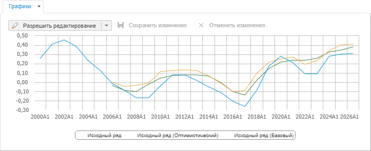

# Особенности отображения данных на графике (веб-приложение)

Особенности отображения данных на графике (веб-приложение)
-

# Особенности отображения данных на графике

Если модель рассчитывается по нескольким сценариям, то на графике отображаются
 значения для каждого сценария. Название сценария содержится в круглых
 скобках рядом с наименованием ряда в легенде. Например:

Период отображения данных на графике уравнения зависит от [состава
 графика](UiModelling_w_rp_chart.htm#composition) и [фильтрации
 данных](../Work/UiModelling_w_Varable.htm#filter_variable_data).

		 Состояние фильтра
		 Состав графика
		 Отображаемые данные

		 Фильтр не задан
		 В состав графика входят все ряды: ряды на прогноз, ряды
		 на идентификацию, факторы.
		 Данные на всём периоде.

		 В состав графика входят только ряды на идентификацию.
		 Данные на всём периоде идентификации.

		 В состав графика входят только ряды на прогноз.
		 Данные на всём периоде прогнозирования.

		 Фильтр задан
		 В состав графика входят все ряды: ряды на прогноз, ряды
		 на идентификацию, факторы.
		 Если в легенде отмечены:

			- только
			 ряды на идентификацию. Отображаются данные на период
			 идентификации с учетом фильтрации;

			- только
			 ряды на прогноз. Отображаются данные на период прогнозирования
			 на с учетом фильтрации;

			- ряды
			 на идентификацию и прогноз. Отображаются данные на
			 всём периоде с учетом фильтрации.

		 В состав графика входят только ряды на идентификацию.
		 Данные на всём периоде идентификации с учетом фильтрации.

		 В состав графика входят только ряды на прогноз.
		 Данные на всём периоде прогнозирования с учетом фильтрации.

См. также:

[Графики](UiModelling_w_rp_chart.htm)

		Справочная
		 система на версию 10.9
		 от 18/08/2025,
		 © ООО «ФОРСАЙТ»,
