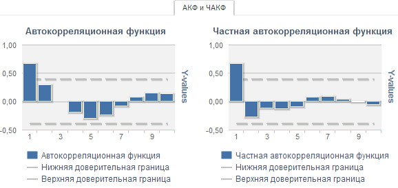

# АКФ и ЧАКФ (веб-приложение)

АКФ и ЧАКФ (веб-приложение)
-

# АКФ и ЧАКФ

Вкладка «АКФ и ЧАКФ» содержит
 результаты [автокорреляционного
 анализа](Lib.chm::/05_Statistics/UiModelling_Autocorrelation.htm): значения автокорреляционной функции и частной
 автокорреляционной функции для моделируемой переменной. Пунктиром отображаются
 границы доверительного интервала.

[Для отображения
 вкладки](javascript:TextPopup(this))

		- Убедитесь, что [панель
		 результатов](../UiModelling_w_ResultPanel.htm) отображается;

		- Выберите:

			- моделируемую переменную или одну из связей уравнения
			 «[ARIMA](../SidePanel/Models/UiModelling_w_eq_Determ.htm)»;

			- переменную, не участвующую в расчёте уравнения;

			- входную переменную уравнения, в котором входная переменная
			 не является моделируемой;

		- Перейдите на вкладку «АКФ
		 и ЧАКФ» в панели результатов.

Например:

Для скрытия/отображения ряда щелкните по его наименованию в легенде.

См. также:

[Работа
 с уравнениями](../Work/Web_Equation_Work.htm)

		Справочная
		 система на версию 10.9
		 от 18/08/2025,
		 © ООО «ФОРСАЙТ»,
