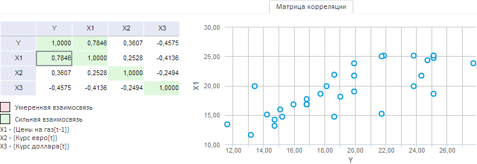
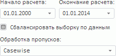

# Вкладка «Матрица корреляции»

Вкладка «Матрица корреляции»
-

# Матрица корреляции

На вкладке «Матрица корреляции»
 отображаются значения коэффициентов [корреляции](Lib.chm::/05_Statistics/UiModelling_CoeffCorr.htm)
 и точечный график зависимостей переменных.

[Для отображения
 вкладки](javascript:TextPopup(this))

		- Убедитесь, что [панель
		 результатов](../UiModelling_w_ResultPanel.htm) отображается.

		- Выберите моделируемую переменную, одну из связей уравнения
		 линейной регрессии или несколько переменных.

		- Перейдите на вкладку «Матрица
		 корреляции» в панели результатов.

Например:

Ячейки таблицы, с полученными значениями, закрашены соответствующими
 цветами:

	- Розовый. Умеренная взаимосвязь.
	 Значение коэффициента корреляции находится в диапазоне по абсолютному
	 значению от 0,5 до 0,75;

	- Зеленый. Сильная взаимосвязь.
	 Значение коэффициента корреляции находится в диапазоне по абсолютному
	 значению от 0,75 и выше.

График зависимостей строится для переменных, коэффициент корреляции
 которых отмечен в таблице.

Если матрица корреляции рассчитывается для переменных, которые не являются
 моделируемыми в каком-либо уравнении, то доступны дополнительные параметры
 расчёта:

	- Начало расчёта. Укажите
	 дату начала расчёта коэффициентов корреляции;

	- Окончание расчёта. Укажите
	 дату окончания расчёта коэффициентов корреляции;

	- Сбалансировать выборку по данным.
	 Укажите, по каким наблюдениям рассчитываются коэффициенты корреляции.
	 По умолчанию флажок установлен и из расчёта исключаются все наблюдения
	 на определенную точку, если на эту точку есть пропуски данных хотя
	 бы в одной переменной. Если флажок установлен, то коэффициенты корреляции
	 рассчитываются по всем возможным данным;

Примечание.
 Параметр актуален, если в качестве метода обработки пропусков используется
 метод «Casewise».

	- Обработка пропусков.
	 Укажите метод для обработки пропусков в данных переменных. Подробное
	 описание доступных методов обработки приведено в разделе «[Обработка
	 пропусков](../SidePanel/UiModelling_w_pp_MissingData.htm)».

См. также:

[Работа
 с уравнениями](../Work/Web_Equation_Work.htm)

		Справочная
		 система на версию 10.9
		 от 18/08/2025,
		 © ООО «ФОРСАЙТ»,
