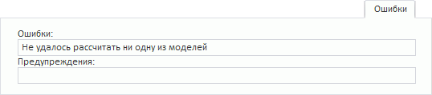

# Ошибки (веб-приложение)

Ошибки (веб-приложение)
-

# Ошибки

Вкладка «Ошибки» отображается,
 если во время расчёта уравнения возникли предупреждения, внутренние ошибки,
 либо неверно заданы параметра метода.

[Для отображения
 вкладки](javascript:TextPopup(this))

		- Убедитесь, что [панель
		 результатов](../UiModelling_w_ResultPanel.htm) отображается;

		- Выберите моделируемую переменную или одну из связей уравнения,
		 при расчёте которого возникли ошибки/предупреждения;

		- Перейдите на вкладку «Ошибки»
		 в панели результатов.

Например:

См. также:

[Работа
 с уравнениями](../Work/Web_Equation_Work.htm)

		Справочная
		 система на версию 10.9
		 от 18/08/2025,
		 © ООО «ФОРСАЙТ»,
