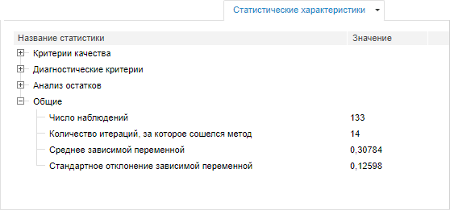

# Статистические характеристики (веб-приложение)

Статистические характеристики (веб-приложение)
-

# Статистические характеристики

На вкладке «Статистические характеристики»
 отображаются значения различных статистических характеристик, рассчитанных
 для уравнения.

[Для отображения
 вкладки](javascript:TextPopup(this))

		- Убедитесь, что [панель
		 результатов](../UiModelling_w_ResultPanel.htm) отображается.

		- Выберите моделируемую переменную или одну из связей уравнения.

		- Перейдите на вкладку «Статистические
		 характеристики» в панели результатов.

Например:

Описание характеристик приведено в разделе «[Статистические
 характеристики](../../2_Container_of_Modeling/2_3_Work_object/2_3_2_Model/Standart_Model/statistical_features.htm)».

[Особенности
 отображения панели](javascript:TextPopup(this))

	Панель «Статистические характеристики»
	 отображается для всех уравнений, кроме:

		- [Детерминированное
		 уравнение](../SidePanel/Models/UiModelling_w_eq_Determ.htm);

		- [Интерполяция](../SidePanel/Models/w_eq_Interpolation.htm);

		- [Коллапс](../SidePanel/Models/w_eq_Collapse.htm);

		- [Пользовательский
		 код](../SidePanel/Models/User_code.htm).

См. также:

[Работа
 с уравнениями](../Work/Web_Equation_Work.htm)

		Справочная
		 система на версию 10.9
		 от 18/08/2025,
		 © ООО «ФОРСАЙТ»,
