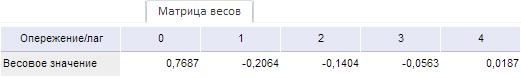

# Матрица весов (веб-приложение)

Матрица весов (веб-приложение)
-

# Матрица весов

Вкладка «Матрица весов» содержит
 матрицу, используемую фильтром Бакстера-Кинга.

[Для отображения
 вкладки](javascript:TextPopup(this))

		- Убедитесь, что [панель
		 результатов](../UiModelling_w_ResultPanel.htm) отображается;

		- Выберите моделируемую переменную или одну из связей уравнения
		 «[Фильтр
		 Бакстера-Кинга](../SidePanel/Models/UiModelling_w_eq_Bpf.htm)»;

		- Перейдите на вкладку «Матрица
		 весов» в панели результатов.

Например:

В столбцах расположены рассчитанные значения коэффициентов. Размерность
 матрицы: 1×(q+1), где q
 - значение параметра «Опережение/лаг»,
 заданного на вкладке боковой панели «[Уравнение](../SidePanel/Models/UiModelling_w_eq_Bpf.htm)».

См. также:

[Работа
 с уравнениями](../Work/Web_Equation_Work.htm)

		Справочная
		 система на версию 10.9
		 от 18/08/2025,
		 © ООО «ФОРСАЙТ»,
