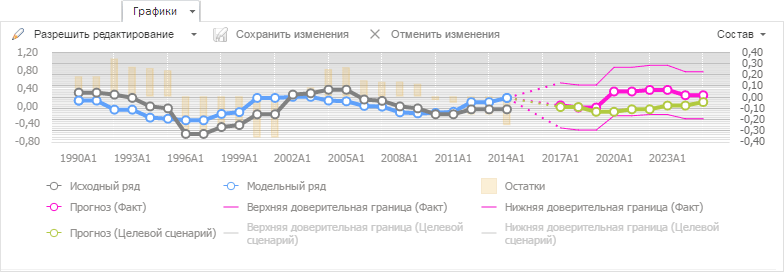
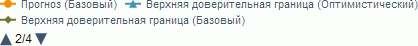
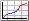
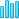
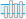

# Вкладка «Графики»: веб-приложение

Вкладка «Графики»: веб-приложение
-

# Графики

На вкладке «Графики» содержится
 графическое представление данных переменной или уравнения, выделенного
 в [рабочей области](../UiModelling_w_WorkingArea.htm).

[Для отображения
 вкладки](javascript:TextPopup(this))

		- Убедитесь, что [панель
		 результатов](../UiModelling_w_ResultPanel.htm) отображается.

		- Выберите моделируемую переменную или одну из связей уравнения.

		- Перейдите на вкладку «Графики»
		 в панели результатов.

Например:

Количество и состав рядов, отображаемых на графике, зависит от того,
 какой объект выбран и используется ли [сценарное
 моделирование](../Work/UiModelling_w_Scenario.htm). Дополнительную информацию об отображении графиков вы
 можете получить в разделе «[Особенности
 отображения данных на графике](Charts_specificity.htm)».

## Операции с графиком

[Изменение
 состава графика](javascript:TextPopup(this))

	Примечание.
	 Возможность доступна только для графика уравнения.

	Для изменения состава графика:

		- Нажмите кнопку «Состав»
		 в правом верхнем углу вкладки.

		- Будет отображено меню, содержащее все возможные ряды. Каждому
		 ряду соответствует флажок. Установите флажок, если требуется,
		 чтобы ряд отображался на графике и снимите флажок, если требуется
		 скрыть ряд на графике.

	График будет перестроен в соответствии с заданными параметрами.

	Возможны следующие ряды:

		- Исходный ряд. Исходные
		 данные моделируемой переменной;

		- Модельный ряд. Смоделированные
		 значения;

		- Остатки. Разница
		 между исходными и смоделированными данными;

		- Прогноз. Прогнозные
		 значения, рассчитанные уравнением;

		- Верхняя доверительная граница.
		 Значения верхней доверительной границы для прогнозных значений;

		- Нижняя доверительная граница.
		 Значения нижней доверительной границы для прогнозных значений;

		- Факторы уравнения.
		 Группа рядов, содержащая факторы уравнения. По умолчанию факторы
		 не включены в график;

		- B1. Ряд после априорной
		 корректировки или исходный ряд;

		- D10. Сезонная составляющая;

		- D11. Сезонная корректировка
		 ряда;

		- D12. Тренд-циклическая
		 компонента;

		- D13. Нерегулярная
		 компонента.

	Примечание.
	 Набор рядов зависит от типа уравнения.

[Просмотр
 значения точки](javascript:TextPopup(this))

	Для просмотра значения точки наведите на неё указатель мыши. Значение
	 будет отображено в виде всплывающей подсказки.

	Примечание.
	 Возможность доступна, если настроено отображение [всплывающих подсказок](UiDiagrams.chm::/Params_diagram/Tooltips.htm).

[Изменение
 значения точки](javascript:TextPopup(this))

	Примечание.
	 Изменение значений доступно, если переменная не является моделируемой
	 в каком-либо уравнении.

	Порядок редактирования:

		- Разрешите редактирование данных.
		 Переведите кнопку  «Разрешить редактирование» в
		 нажатое состояние.

		- Выберите режим редактирования
		 и измените данные. Для выбора режима используйте раскрывающееся
		 меню кнопки  «Разрешить редактирование»:

		-

			- По
			 точкам. Редактирование каждой точки переменной выполняется
			 по отдельности.

			Выберите мышью переменную в легенде или на диаграмме. На графике
			 будут выделены точки, доступные для редактирования. Наведите
			 указатель на точку переменной (курсор примет вид двунаправленной
			 стрелки), зажмите кнопку мыши и переместите точку
			 в новое положение. Текущее значение точки отображается рядом
			 с ней;

			- Рисование. Редактирование
			 нескольких точек переменной выполняется одним движением.

			Выберите мышью переменную в легенде. На графике будут выделены
			 точки, доступные для редактирования. Наведите указатель на
			 точку переменной (фон переменной по оси значений будет подсвечен),
			 зажмите кнопку мыши и переместите точку в новое положение.
			 Редактирование соседних точек можно продолжить, не отпуская
			 кнопки. Текущее значение редактируемой точки отображается
			 рядом с ней.

	Для сохранения измененных данных нажмите кнопку  «Сохранить изменения».

[Скрытие/отображение
 ряда](javascript:TextPopup(this))

	Перед скрытием/отображением ряда выключите режим редактирования
	 данных. Переведите кнопку  «Разрешить
	 редактирование» в ненажатое состояние.

	Для скрытия/отображения ряда щелкните по его наименованию в легенде.

[Отображение
 скрытых элементов легенды](javascript:TextPopup(this))

	Если не все элементы помещаются в видимую область легенды, то отображаются
	 кнопки для прокрутки легенды: 
	 и . Используйте их для отображения
	 скрытых элементов легенды. Между кнопками содержится информация о
	 странице легенды в формате: <номер
	 текущей страницы>/<общее
	 количество страниц>.

	Пример легенды, содержащей скрытые элементы:

	

[Отображение/скрытие
 прогнозных значений](javascript:TextPopup(this))

	Для отображения/скрытия прогнозных значений, рассчитанных уравнением,
	 используйте кнопку  «Показать прогноз» на вкладке ленты
	 инструментов «Вид».

[Изменение
 типа графика](javascript:TextPopup(this))

	Для изменения типа графика нажмите кнопку  «Тип» на вкладке ленты
	 инструментов «Диаграмма».
	 Будет отображено меню, содержащее пиктограммы, соответствующие различным
	 [типам
	 диаграмм](UiDiagrams.chm::/Type_diagrams/UiDiagrams_Type_diagrams.htm). При наведении указателя мыши на пиктограмму
	 будет отображена всплывающая подсказка с названием типа диаграммы.
	 Выберите требуемый тип диаграммы;

	Тип графика также можно изменить на вкладке «[Диаграмма](uidiagrams.chm::/Params_diagram/UiDiagrams_params_diagram.htm)» в
	 группе вкладок «Панель результатов»
	 на боковой панели.

[Отображение
 коридоров](javascript:TextPopup(this))

	В веб-приложении для автоматического построения коридоров на диаграмме
	 уравнения нажмите кнопку  «Коридоры диаграмм» на вкладке «Диаграмма» ленты инструментов. Коридор
	 будет добавлен между прогнозным рядом и доверительными границами.

	Примечание.
	 Коридор будет отображаться, если прогнозный ряд и ряды доверительных
	 границ присутствуют на диаграмме.

### Настройка формата компонентов графика

Для настройки формата компонентов графика используйте вкладки боковой
 панели. Для отображения данных вкладок выделите график и установите переключатель
 «Панель результатов» на боковой
 панели. Доступна настройка:

	- [общих
	 параметров диаграммы](UiDiagrams.chm::/Params_diagram/UiDiagrams_params_diagram.htm);

	- [легенды](UiDiagrams.chm::/Property_diagramm/UiDiagrams_PropertyDiagramm_legend.htm);

	- [области
	 построения](UiDiagrams.chm::/Tuning_format/uidiagrams_tuning_construction_area_digramm.htm);

	- [осей
	 диаграммы](UiDiagrams.chm::/Params_diagram/UiDiagrams_Axis.htm) (X, Y, дополнительная ось);

	- [линии
	 тренда](UiDiagrams.chm::/look_and_feel/Report/Trend_Lines.htm);

	- [рядов
	 данных](UiDiagrams.chm::/Series.htm);

	- [линий
	 уровня](UiDiagrams.chm::/Tuning_format/Format_Axis/UiDiagrams_FormatAxis_Levels.htm);

	- [подписей
	 данных](UiDiagrams.chm::/Property_diagramm/UiDiagrams_PropertyDiagramm_Label.htm);

	- [всплывающих
	 подсказок](UiDiagrams.chm::/Params_diagram/Tooltips.htm).

См. также:

[Работа
 с уравнениями](../Work/Web_Equation_Work.htm)

		Справочная
		 система на версию 10.9
		 от 18/08/2025,
		 © ООО «ФОРСАЙТ»,
