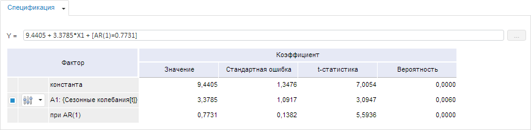
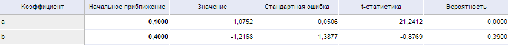
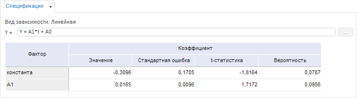

# Спецификация (веб-приложение)

Спецификация (веб-приложение)
-

# Спецификация

На вкладке «Спецификация» содержатся:
 идентифицированное уравнение с оцененными коэффициентами и таблица коэффициентов.

Для отображения вкладки «Спецификация»:

	- Убедитесь, что [панель
	 результатов](../UiModelling_w_ResultPanel.htm) отображается.

	- Выберите [целевую
	 функцию](../Work/OptimalControl/CriterionFunct.htm), [моделируемую
	 переменную](../Work/UiModelling_w_Varable.htm) или одну из [связей
	 уравнения](../Work/Varables/Create_Equation.htm) на [рабочей
	 области](../UiModelling_w_WorkingArea.htm).

Примечание.
 Вкладка доступна, если используется [целевая
 функция](../Work/OptimalControl/CriterionFunct.htm) или один из видов уравнения: [линейная
 регрессия](../SidePanel/Models/UiModelling_w_eq_LinearRegr.htm), [нелинейная
 регрессия](../SidePanel/Models/UiModelling_w_eq_NonLinearRegr.htm), [ARIMA](../SidePanel/Models/UiModelling_w_eq_ARIMA.htm),
 [детерминированное
 уравнение](../SidePanel/Models/UiModelling_w_eq_Determ.htm), [тренд](../SidePanel/Models/UiModelling_w_eq_CurveEst.htm),
 [пользовательский код](../SidePanel/Models/User_code.htm).

После выполнения действий перейдите на вкладку «Спецификация»
 на [панели результатов](../UiModelling_w_ResultPanel.htm):

В таблице коэффициентов содержатся:

	- Фактор. Наименование
	 фактора, при котором оценивался коэффициент.

	Если для фактора доступно [выполнение
	 дополнительных операций](../Work/Varables/Var_Fast_Transform.htm), то для него отображается кнопка . Для выполнения операций нажмите
	 кнопку и используйте команды в отобразившемся меню;

	- Значение. Оцененное
	 значение коэффициента;

	- Стандартная ошибка.
	 Приближённая величина отклонения (вызванного случайностью выборки)
	 оценки коэффициента от истинного значения. Чем больше значение [стандартной
	 ошибки](Lib.chm::/05_Statistics/UiModelling_StdError.htm), тем менее достоверной является оценка коэффициента;

	- t-статистика. Вычисляется
	 как отношение оценки коэффициента к его стандартной ошибке. Используется
	 для проверки нулевой гипотезы о том, что коэффициент равен нулю, то
	 есть не значим в рассматриваемой модели регрессии. Гипотеза проверяется
	 в предположении, что остатки имеют нормальное распределение. Проводить
	 интерпретацию значения [t-статистики](Lib.chm::/05_Statistics/UiModelling_t_stat.htm)
	 легче с помощью значения вероятности, которое приводится рядом;

	- Вероятность. Значение
	 вероятности для t-статистики. Нулевая гипотеза о равенстве нулю оценки
	 коэффициента отклоняется на выбранном уровне значимости (как правило,
	 0,1, 0,05, 0,01), если вероятность меньше, чем уровень значимости.

## Особенности работы

Особенности работы с вкладкой «Спецификация»
 зависят от [вида
 уравнения](UiModelling.chm::/Web/Work/Configure_equation_parameters.htm):

[Линейная регрессия](javascript:TextPopup(this))

	В таблице каждому фактору соответствует флажок. Если флажок установлен,
	 то переменная участвует в расчёте. Если флажок снят, то расчёт выполняется
	 без участия переменной.

	Примечание.
	 Идентифицированное уравнение задается автоматически и недоступно для
	 редактирования.

[Нелинейная
 регрессия](javascript:TextPopup(this))

	Доступно редактирование формулы идентифицированного уравнения вручную.
	 Наименования всех используемых переменных в формуле должны быть указаны
	 в фигурных скобках.

	В таблице отображаются коэффициенты уравнения со значениями их начальных
	 приближений:

	

	Доступно изменение значений начальных приближений коэффициентов.
	 Для этого введите требуемые значения начальных приближений в столбец
	 «Начальное приближение».

	Примечание.
	 Для возврата начальных приближений, заданных по умолчанию, установите
	 флажок «Использовать начальные приближения
	 по умолчанию» на вкладке «[Параметры
	 оценки](../SidePanel/Models/UiModelling_w_eq_NonLinearRegr.htm#evaluation_parameters)» на боковой панели. Флажок автоматически снимается
	 при редактировании значений начальных приближений.

[Детерминированное
 уравнение](javascript:TextPopup(this))

	Доступно редактирование формулы идентифицированного уравнения вручную
	 или с помощью [редактора
	 выражения](UiNav.chm::/GUI/ExpressionEditor.htm).
	 Для открытия редактора выражения нажмите кнопку 
	 напротив уравнения.

	Наименования всех используемых переменных в формуле должны быть
	 указаны в фигурных скобках. Также можно использовать любые арифметические
	 операции, круглые скобки, допускается использование статистических,
	 [математических
	 функций](UiNav.Chm::/GUI/Expression_editor_func.htm).

	Примечание.
	 Если детерминированное уравнение получено в результате изменения вида
	 уравнения линейной/нелинейной регрессии, то в формуле будут присутствовать
	 рассчитанные коэффициенты регрессии.

	В таблице отображается только список факторов.

[Тренд](javascript:TextPopup(this))

	Идентифицированное уравнение и таблица коэффициентов рассчитываются
	 для каждой [исследуемой
	 модели зависимости](../SidePanel/Models/UiModelling_w_eq_CurveEst.htm).

	Примечание.
	 Идентифицированное уравнение задается автоматически и недоступно для
	 редактирования.

	На вкладке «Спецификация»
	 содержатся данные для зависимости, выделенной на вкладке боковой панели
	 «[Уравнение](../SidePanel/Models/UiModelling_w_eq_CurveEst.htm)».
	 Название зависимости отображается перед идентифицированным уравнением.
	 Например:

	

[Пользовательский
 код](javascript:TextPopup(this))

	Отсутствует таблица коэффициентов факторов.

	Доступно формирование формулы расчёта метода вручную. Для получения
	 подробной информации обратитесь к разделу «[Пользовательский
	 код](../SidePanel/Models/User_code.htm)».

Для [целевой функции](../Work/OptimalControl/CriterionFunct.htm)
 особенности работы c вкладкой «Спецификация»
 приведены в разделе «[Настройка
 выражения целевой функции](../Work/OptimalControl/Optimal_control_funct.htm)».

См. также:

[Работа
 с уравнениями](../Work/Web_Equation_Work.htm)

		Справочная
		 система на версию 10.9
		 от 18/08/2025,
		 © ООО «ФОРСАЙТ»,
