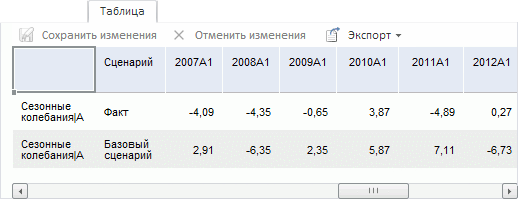
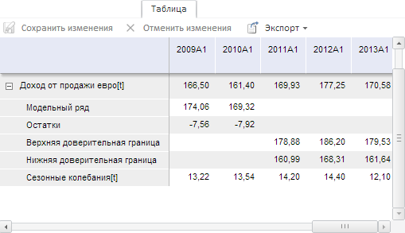

# Вкладка «Таблица»: веб-приложение

Вкладка «Таблица»: веб-приложение
-

# Таблица

На вкладке «Таблица» содержится
 табличное представление данных переменной или уравнения, выделенного в
 [рабочей области](../UiModelling_w_WorkingArea.htm).

[Для отображения
 вкладки](javascript:TextPopup(this))

		- Убедитесь, что [панель
		 результатов](../UiModelling_w_ResultPanel.htm) отображается.

		- Выберите моделируемую переменную или одну из связей уравнения.

		- Перейдите на вкладку «Таблица»
		 в панели результатов.

Если модель рассчитывается по нескольким сценариям, то в таблице отображаются
 значения для каждого сценария. Например:

Ряд, отображающий значения уравнения, содержит дочерние ряды. Например:

Набор дочерних рядов зависит от вида уравнения.

[Редактирование
 данных](javascript:TextPopup(this))

	Примечание.
	 Редактирование значений доступно, если переменная не является моделируемой
	 в каком-либо уравнении.

	Введите требуемые значения в таблицу данных.

[Сохранение
 данных](javascript:TextPopup(this))

	Для сохранения измененных данных нажмите кнопку  «Сохранить изменения».

[Отмена
 изменений в данных](javascript:TextPopup(this))

	Для отмены изменений в несохраненных данных нажмите кнопку  «Отменить изменения».

[Экспорт
 данных](javascript:TextPopup(this))

	Для экспорта таблицы данных:

		- Нажмите кнопку  «Экспорт».

		- В отобразившемся меню выберите формат экспорта таблицы:

			- книга Excel (Таблица.xlsx);

			- книга Excel 97-2003 (Таблица.xls).

	Таблица будет экспортирована в файл указанного формата в папку загрузки,
	 используемую браузером.

См. также:

[Работа
 с уравнениями](../Work/Web_Equation_Work.htm)

		Справочная
		 система на версию 10.9
		 от 18/08/2025,
		 © ООО «ФОРСАЙТ»,
