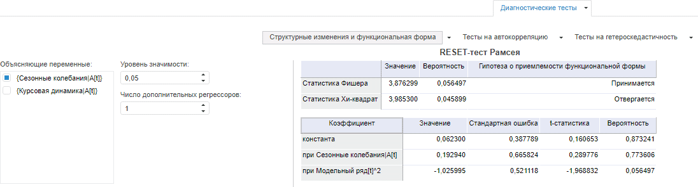
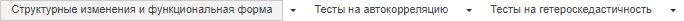

# Выполнение диагностических тестов

Выполнение диагностических тестов
-

# Выполнение диагностических тестов

Для выполнения диагностических тестов для модели [линейной
 регрессии](../SidePanel/Models/UiModelling_w_eq_LinearRegr.htm) предназначена вкладка «Диагностические
 тесты», расположенная на [панели
 результатов](../UiModelling_w_ResultPanel.htm).

Для выполнения тестов выберите моделируемую переменную или одну из связей
 уравнения [линейной
 регрессии](../SidePanel/Models/UiModelling_w_eq_LinearRegr.htm). Результаты расчётов отображаются на вкладке «Диагностические
 тесты» на панели результатов.

[Для отображения
 вкладки](javascript:TextPopup(this))

		- Убедитесь, что [панель
		 результатов](../UiModelling_w_ResultPanel.htm) отображается;

		- Выберите моделируемую переменную или одну из связей уравнения
		 [линейной
		 регрессии](../SidePanel/Models/UiModelling_w_eq_LinearRegr.htm);

		- Перейдите на вкладку «Диагностические
		 тесты».

Пример вкладки:

На вкладке содержатся параметры расчёта теста и результаты его расчёта.

Набор параметров и результаты зависят от выбранного теста. Для выбора
 теста используйте элементы в верхней части вкладки:

Все диагностические тесты делятся на несколько групп. Каждой группе
 соответствует переключатель и кнопка для вызова меню со списком тестов,
 входящих в группу. Для расчёта и просмотра результата теста выберите его
 в меню.

Доступные диагностические тесты:

	- Структурные изменения и функциональная форма:

	-

		- [RESET-тест
		 Рамсея](../Work/Diagnostics_tst/RESET_tst.htm);

	- Тесты на автокорреляцию:

	-

		- [Тест Бреуша-Годфри
		 (LM-тест)](../Work/Diagnostics_tst/LM_tst.htm);

	- Тесты на гетероскедастичность:

	-

		- [Тест Уайта](../Work/Diagnostics_tst/White_tst.htm).

Совет. Для расчета
 диагностических тестов с помощью методов R установите флажок «Использовать
 R при расчете описательных статистик» на вкладке «Расчет»
 в диалоге «[Параметры](../Work/Modelling_setup.htm)».
 Возможность доступна для всех тестов, кроме теста Уайта, если в «Форсайт. Аналитическая платформа» подключен
 пакет R. Подробнее см. раздел: «[Как
 настроить интеграцию с R?](../../FAQ/R_Integration.htm)».

См. также:

[Работа с уравнениями](../Work/Web_Equation_Work.htm)

		Справочная
		 система на версию 10.9
		 от 18/08/2025,
		 © ООО «ФОРСАЙТ»,
