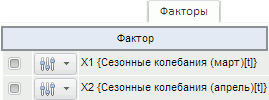

# Факторы (веб-приложение)

Факторы (веб-приложение)
-

# Факторы

Вкладка «Факторы» содержит таблицу
 с наименованиями факторов уравнения.

[Для отображения
 вкладки](javascript:TextPopup(this))

		- Убедитесь, что [панель
		 результатов](../UiModelling_w_ResultPanel.htm) отображается;

		- Выберите моделируемую переменную или одну из связей уравнения
		 «[Нелинейная
		 регрессия](../SidePanel/Models/UiModelling_w_eq_NonLinearRegr.htm)» или «[Модель коррекции ошибок](../SidePanel/Models/w_eq_ECM.htm)»;

		- Перейдите на вкладку «Факторы»
		 в панели результатов.

Например:

Каждому фактору соответствует флажок. Если флажок установлен, то переменная
 участвует в расчёте; если снят - расчёт выполняется без участия переменной.

Также для факторов доступно выполнение [дополнительных
 операций](../Work/Varables/Var_Fast_Transform.htm). Нажмите кнопку . Используйте
 команды в отобразившемся меню.

См. также:

[Работа
 с уравнениями](../Work/Web_Equation_Work.htm)

		Справочная
		 система на версию 10.9
		 от 18/08/2025,
		 © ООО «ФОРСАЙТ»,
