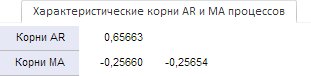

# Вкладка «Характеристические корни AR и MA процессов»: веб-приложение

Вкладка «Характеристические корни AR и MA процессов»: веб-приложение
-

# Характеристические корни AR и MA процессов

Вкладка «Характеристические корни AR
 и MA процессов» содержит значения характеристических корней авторегрессии
 (AR) и скользящего среднего (MA) и отображается, если для уравнения задан
 порядок AR или MA.

[Для отображения
 вкладки](javascript:TextPopup(this))

		- Убедитесь, что [панель
		 результатов](../UiModelling_w_ResultPanel.htm) и боковая панель
		 отображаются;

		- Выберите моделируемую переменную или одну из связей уравнения
		 «[Линейная регрессия](../SidePanel/Models/UiModelling_w_eq_LinearRegr.htm)» или «[ARIMA](../SidePanel/Models/UiModelling_w_eq_ARIMA.htm)»;

		- Перейдите на вкладку «Уравнение»
		 на боковой панели;

		- Задайте порядок авторегрессии или скользящего среднего;

		- Перейдите на вкладку «Характеристические
		 корни AR и MA процессов» в панели результатов.

Например:

В столбцах расположены рассчитанные значения корней.

Если в уравнении «[ARIMA](../SidePanel/Models/UiModelling_w_eq_ARIMA.htm)»
 корни были рассчитаны для сезонных и несезонных авторегрессии/скользящего
 среднего, то в первом столбце содержится несезонное значение, во втором
 - сезонное.

См. также:

[Работа
 с уравнениями](../Work/Web_Equation_Work.htm)

		Справочная
		 система на версию 10.9
		 от 18/08/2025,
		 © ООО «ФОРСАЙТ»,
