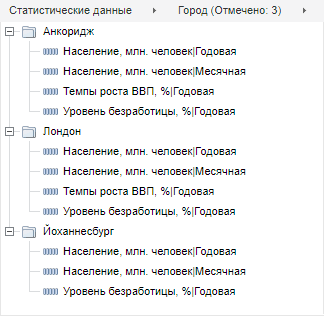

# Дерево рядов

Дерево рядов
-

# Дерево рядов

Дерево рядов отображает древовидную структуру элементов открытого источника
 данных и предназначено для добавления переменных в модель. В качестве
 источников доступны базы данных временных рядов.

Пример дерева рядов:

Структура дерева формируется на основании последовательности атрибутов,
 заданных в цепочке навигации. Уровни иерархии дерева отображаются в виде
 папок, названия которых соответствуют значениям атрибута. В дереве рядов
 доступна множественная отметка элементов при зажатой клавише SHIFT или
 CTRL.

Цепочка навигации расположена над деревом рядов. Работа с ней доступна
 после выбора источника данных. Первым в цепочке навигации отображается
 название базы данных временных рядов, используемой в качестве источника
 данных, далее отображаются её атрибуты. После изменения порядка атрибутов
 в цепочке навигации, иерархия дерева рядов перестраивается. Если в цепочке
 навигации отсутствуют выбранные атрибуты, то элементы отображаются в виде
 списка.

## Операции с деревом рядов

[Отображение/скрытие
 дерева рядов](javascript:TextPopup(this))

		- Перейдите на вкладку «Главная»
		 или «Вид» на ленте инструментов.

		- Используйте кнопку  «Дерево рядов».

[Выбор
 источника данных](javascript:TextPopup(this))

		- Перейдите на вкладку «Главная»
		 или «Вид» на ленте инструментов.

		- Нажмите нижнюю часть кнопки  «Дерево рядов» для отображения
		 списка всех доступных источников данных.

		- Выберите необходимый источник.

	Дерево элементов и цепочка навигации будут перестроены в соответствии
	 с выбранным источником.

[Добавление нового
 источника данных](javascript:TextPopup(this))

		- Перейдите на вкладку «Главная»
		 или «Вид» на ленте инструментов.

		- Нажмите нижнюю часть кнопки  «Дерево рядов» для отображения
		 списка всех доступных источников данных.

		- Нажмите кнопку «Импорт
		 данных».

	Будет открыт [мастер
	 импорта данных](UiNavObj.chm::/Data_import_wizard/Data_import_wizard.htm).

## Операции с элементами дерева рядов

[Отображение/скрытие
 всплывающей подсказки](javascript:TextPopup(this))

		- Вызовите контекстное меню дерева рядов.

		- Установите/снимите флажок «Отображать
		 всплывающую подсказку». По умолчанию флажок снят и всплывающая
		 подсказка не отображается.

[Фильтрация
 пустых элементов](javascript:TextPopup(this))

		- Вызовите контекстное меню дерева
		 рядов.

		- Выберите пункт «Скрывать».
		 Отобразится меню для настройки параметров фильтрации:

			- Нет фильтра.
			 Если переключатель установлен, то пустые элементы не фильтруются.
			 В дереве рядов отображаются пустые папки и не существующие,
			 но возможные элементы. Несуществующие элементы - это элементы,
			 получаемые разницей между декартовым произведением всех атрибутов,
			 отображаемых в дереве элементов, и существующими элементами;

			- Пустые ряды.
			 Если переключатель установлен, то в дереве рядов не отображаются
			 элементы без данных;

			- Пустые ряды и папки.
			 Если переключатель установлен, то в дереве рядов не отображаются
			 элементы без данных и папки без элементов. По умолчанию
			 переключатель установлен.

	Дерево рядов будет перестроено с учётом заданной фильтрации.

## Операции с цепочкой навигации

[Вызов
 меню источника данных/атрибута в цепочке навигации](javascript:TextPopup(this))

	Для вызова меню используйте кнопку .

	Если меню вызвано для:

		- источника данных.
		 Будет отображён список всех атрибутов источника и команды для
		 работы со цепочкой навигации;

		- атрибута. Будет
		 отображён список атрибутов, ещё не использованных в цепочке навигации
		 и команды для работы с атрибутом.

[Добавление атрибута
 в цепочку навигации](javascript:TextPopup(this))

		- Нажмите кнопку .

		- В меню выберите атрибут из группы «Добавить».

	Атрибут будет добавлен в цепочку навигации после кнопки . Все
	 последующие атрибуты будут удалены.

[Замена атрибута
 в цепочке навигации](javascript:TextPopup(this))

		- [Вызовите меню атрибута](SeriesTree_web.htm#menu),
		 нажав кнопку .

		- В меню выберите атрибут из группы «Заменить».

	Атрибут будет помещён в цепочку навигации вместо атрибута, меню
	 которого было вызвано. Порядок и состав прочих атрибутов не меняется.

[Использование
 последовательности атрибутов, заданных по умолчанию в источнике данных](javascript:TextPopup(this))

	При создании базы данных временных рядов указывается [последовательность
	 атрибутов по умолчанию](UiNavObj.chm::/TimeSeriesDatabase/TS_Attributes.htm#attr_order).

	Для использования данной последовательности в цепочке навигации:

		- [Вызовите меню источника
		 данных](SeriesTree_web.htm#menu), нажав кнопку .

		- Выполните команду «Порядок
		 по умолчанию».

	Последовательность атрибутов будет изменена.

[Удаление атрибута
 из цепочки навигации](javascript:TextPopup(this))

		- [Вызовите меню атрибута](SeriesTree_web.htm#menu),
		 нажав кнопку .

		- Выполните команду «Удалить».

	Атрибут будет удалён из цепочки навигации.

[Очистка цепочки
 навигации](javascript:TextPopup(this))

		- [Вызовите меню атрибута](SeriesTree_web.htm#menu),
		 нажав кнопку .

		- Выполните команду «Очистить
		 цепочку».

	Все атрибуты из цепочки навигации будут удалены.

[Просмотр
 значений атрибута](javascript:TextPopup(this))

	Для отображения иерархического списка со значениями атрибута щелкните
	 по его наименованию.

	Для разворачивания/сворачивания иерархии в списке используйте команды
	 контекстного меню: «Развернуть все»
	 и «Свернуть все».

[Сортировка значений
 атрибута](javascript:TextPopup(this))

	Для быстрой сортировки:

		- [Вызовите меню атрибута](SeriesTree_web.htm#menu),
		 нажав кнопку .

		- Выберите пункт «Сортировка».
		 Отобразится подменю для установки порядка сортировки значений
		 атрибутов.

		- Установите переключатель, определяющий направление сортировки.
		 По умолчанию сортировка не выполняется.

	Порядок элементов будет изменён в соответствии с выбранным направлением
	 сортировки.

	Для расширенной сортировки:

		- [Отобразите список значений
		 атрибута](SeriesTree_web.htm#attvals).

		- Вызовите контекстное меню списка.

		- Выберите пункт «Сортировка».
		 Отобразится подменю:

			- По возрастанию.
			 Сортировка выполняется по возрастанию значений атрибута;

			- По убыванию.
			 Сортировка выполняется по убыванию значения атрибута;

		-

			- По атрибуту.
			 Список содержит все атрибуты исходного измерения. Установите
			 переключатель напротив атрибута, по значениям которого требуется
			 сортировка.

			Если до выбора атрибута направление сортировки не задано, то
			 выполняется сортировка по возрастанию значений.

	Порядок элементов будет изменён в соответствии с заданными параметрами
	 сортировки.

[Фильтрация дерева
 рядов по значениям атрибута](javascript:TextPopup(this))

		- [Вызовите меню атрибута](SeriesTree_web.htm#menu),
		 нажав кнопку .

		- Установите флажок «Фильтрация».

	Для задания фильтра отметьте необходимые элементы в [списке
	 значений атрибута](SeriesTree_web.htm#attvals). Данные об отметке отображаются в круглых скобках
	 после наименования атрибута в цепочке навигации.

[Изменение наименования
 элементов в списке значений атрибута](javascript:TextPopup(this))

		- Вызовите контекстное меню [списка значений атрибута](SeriesTree_web.htm#attvals);

		- Выберите пункт «Наименования».
		 Отобразится подменю:

			- По умолчанию.
			 Для наименования элементов в списке значений атрибута будет
			 использоваться атрибут, заданный по умолчанию для формирования
			 наименования элементов в исходном измерении;

			- Список атрибутов измерения.
			 Список содержит все атрибуты исходного измерения. Установите
			 переключатель напротив атрибутов, значения которых должны
			 отображаться в списке.

	Наименования элементов в списке будут изменены в соответствии с
	 заданными параметрами.

См. также:

[Рабочая область](UiModelling_w_WorkingArea.htm)

		Справочная
		 система на версию 10.9
		 от 18/08/2025,
		 © ООО «ФОРСАЙТ»,
