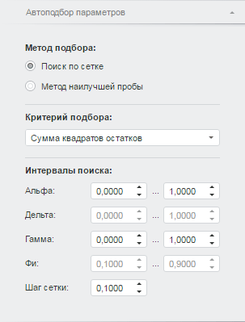
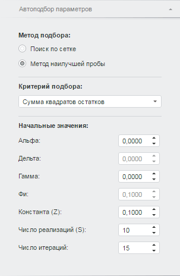

# Настройка автоподбора значений параметров

Настройка автоподбора значений параметров
-

# Настройка автоподбора значений параметров

Для настройки параметров автоматического подбора значений коэффициентов
 в уравнении «[Экспоненциальное
 сглаживание](Models/UiModelling_w_eq_ExpSmooth.htm)» используйте вкладку «Автоподбор
 параметров» на боковой панели.

[Для отображения
 вкладки](javascript:TextPopup(this))

		- Убедитесь, что боковая панель
		 отображается.

		- Выберите моделируемую переменную или одну из связей уравнения.

		- Перейдите на вкладку «Уравнение».

		- Установите переключатель «Авто»
		 для одного из коэффициентов: «Альфа», «Дельта», «Гамма» или «Фи».

		- Перейдите на вкладку «Автоподбор
		 параметров».

Вкладка содержит группы: «Метод подбора»,
 «Критерий подбора» и группу, вид
 и наименование которой зависят от выбранного метода подбора значений коэффициентов.

Группа «Метод подбора» определяет
 используемый метод подбора значений коэффициентов:

	- поиск по сетке;

	- метод наилучшей пробы.

Группа «Критерий подбора»
 определяет критерий, по которому подбираются значения коэффициентов:

	- сумма квадратов отклонений прогнозных
	 значений на каждую точку идентификации;

	- модуль среднего остатков;

	- среднее модулей остатков;

	- сумма квадратов остатков.

## Поиск по сетке

Параметры автоподбора значений, если используется метод поиска «Поиск по сетке»:

Группа «Интервалы поиска» определяет,
 в каких пределах искать значения коэффициентов «Альфа», «Дельта», «Гамма», «Фи». В соответствующих редакторах
 чисел задайте интервал поиска, учитывая ограничения:

	- для нижней границы (первый редактор чисел) минимальное значение
	 - нуль, максимальное - единица;

	- для верхней границы (второй редактор чисел) минимальное значение
	 - значение нижней границы, максимальное - единица.

Доступность интервалов поиска значений коэффициентов зависит от сезонного
 эффекта и модели роста. Если значение коэффициента было установлено вручную,
 то редактирование интервала недоступно.

Параметр «Шаг сетки» определяет
 величину интервала, с которым выполняется поиск по сетке.

## Метод наилучшей пробы

Параметры автоподбора значений, если используется метод поиска «Метод наилучшей пробы»:

Группа «Начальные значения»
 определяет:

	- Альфа. Дельта. Гамма. Фи.
	 В соответствующих редакторах чисел задайте начальные значения для
	 поиска значений коэффициентов. Доступность редакторов зависит от сезонного
	 эффекта и модели роста. Если значение коэффициента было задано вручную,
	 то редактирование также недоступно;

	- Константа (Z). Вещественное
	 значение константы, используемое для метода наилучшей пробы;

	- Число реализаций (S).
	 Число реализаций коэффициента;

	- Число итераций. Максимальное
	 число итераций, за которое должно быть получено значение.

См. также:

[Работа
 с уравнениями](../Work/Web_Equation_Work.htm) | [Экспоненциальное
 сглаживание](Models/UiModelling_w_eq_ExpSmooth.htm)

		Справочная
		 система на версию 10.9
		 от 18/08/2025,
		 © ООО «ФОРСАЙТ»,
