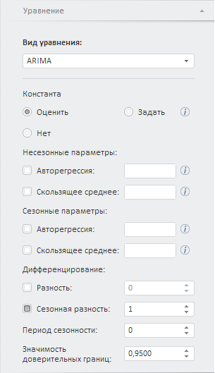

# ARIMA (веб-приложение)

ARIMA (веб-приложение)
-

# ARIMA

ARIMA - одна из наиболее популярных моделей для построения краткосрочных
 прогнозов.

Примечание.
 В методе «ARIMA» входная переменная
 одновременно является и моделируемой. Для создания уравнения установите
 связь переменной с самой собой.

Для настройки параметров метода используйте вкладку «Уравнение»
 на боковой панели.

[Для отображения
 вкладки](javascript:TextPopup(this))

		- Убедитесь, что боковая панель
		 отображается.

		- Выберите моделируемую переменную или одну из связей уравнения
		 вида «ARIMA».

		- Перейдите на вкладку «Уравнение»
		 на боковой панели.

Параметры метода:

	- Константа. Укажите метод
	 расчёта константы:

	-

		- Оценить. Значение
		 константы оценивается автоматически в процессе расчёта метода.
		 Полученное значение отображается в данной группе параметров;

		- Задать. Значение
		 константы задается пользователем в соответствующем поле, которое
		 доступно для ввода после установки данного переключателя;

		- Нет. Используется
		 по умолчанию. Константа в модели не используется;

	- Несезонные/сезонные параметры.
	 Задайте несезонные/сезонные параметры метода:

	-

		- Авторегрессия. По
		 умолчанию флажок снят. Если флажок установлен, то учитывается
		 указанный порядок несезонной/сезонной авторегрессии;

		- Скользящее среднее.
		 По умолчанию флажок снят. Если флажок установлен, то учитывается
		 указанный порядок несезонного/сезонного скользящего среднего;

Примечание.
 Если рассчитывается метод «ARIMA»,
 то номера или диапазоны порядка сезонного/несезонного скользящего среднего
 и сезонной/несезонной авторегрессии вводятся, разделенные запятыми. Диапазон
 порядка указывается через знак «-». Например: 1-3,5,7-9.

Если рассчитывается метод «ARIMA (R)»,
 то параметры авторегрессии и скользящего среднего определяются как диапазон
 значений 1-N. Задайте максимальный
 порядок N.

Если для метода «ARIMA» задан
 порядок авторегрессии и/или скользящего среднего, то на боковой панели
 отображается вкладка «[Параметры
 оценки ARMA](../UiModelling_w_pp_ARMA.htm)» для настройки параметров авторегрессии/скользящего среднего.

	- Дифференцирование.
	 Задайте параметры дифференцирования исходного ряда и сезонной составляющей:

	-

		- Разность. По умолчанию
		 флажок снят. Если флажок установлен, то учитывается указанный
		 порядок дифференцирования несезонной/сезонной составляющей ряда.
		 Значение по умолчанию - «1»;

		- Сезонная разность.
		 По умолчанию флажок установлен и учитывается указанный порядок
		 дифференцирования сезонной составляющей. Значение по умолчанию
		 - «1»;

		- Период сезонности.
		 Учитывается, если при расчёте модели используется сезонная разность.
		 Период сезонности определяет продолжительность периода сезонности
		 (например, четыре квартала или двенадцать месяцев). Значение по
		 умолчанию - «0»;

	- Значимость доверительных границ.
	 Задайте уровень значимости доверительных границ прогнозного ряда.
	 Может принимать значения из интервала (0, 1). Значение по умолчанию
	 - «0,95».

Для оценки качества полученного уравнения предназначены [диагностические
 тесты](../../ResultsPanel/w_rp_diagnostics_tst.htm). Для их проведения используйте язык [Fore](KeMs.chm::/Interface/IMsDiagnosticTestList/IMsDiagnosticTestList.htm).

См. также:

[Работа
 с уравнениями](../../Work/Web_Equation_Work.htm) | Метод
 «[ARIMA](Lib.chm::/02_Time_series_analysis/UiModelling_ARIMA.htm)»
 | Анализ временных рядов: [ARIMA](UiDw.chm::/Workbook/CalculatedSeries/Forecast/UiDw_cs_ARIMA.htm) |
 [IModelling.Arima](KeMs.chm::/Interface/IModelling/IModelling.Arima.htm)

		Справочная
		 система на версию 10.9
		 от 18/08/2025,
		 © ООО «ФОРСАЙТ»,
