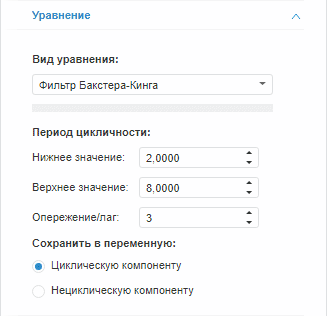

# Фильтр Бакстера-Кинга (веб-приложение)

Фильтр Бакстера-Кинга (веб-приложение)
-

# Фильтр Бакстера-Кинга

Фильтр Бакстера-Кинга - это метод сглаживания временного ряда, который
 является модификацией [фильтра Ходрика-Прескотта](UiModelling_w_eq_Hpf.htm)
 с более широкими возможностями исключения циклической составляющей во
 временном ряде.

Примечание.
 В методе «Фильтр Бакстера-Кинга»
 входная переменная одновременно является и моделируемой. Для создания
 уравнения установите связь переменной с самой собой.

Для настройки параметров метода используйте вкладку «Уравнение»
 на боковой панели.

[Для отображения
 вкладки](javascript:TextPopup(this))

		- Убедитесь, что боковая панель отображается.

		- Выберите моделируемую переменную или одну из связей уравнения
		 вида «Фильтр Бакстера-Кинга».

		- Перейдите на вкладку «Уравнение»
		 на боковой панели.

Параметры метода:

	- Период цикличности.
	 Укажите значения верхней и нижней границ периода цикличности;

	- Опережение/лаг. Задайте
	 размер интервала, на котором рассчитывается скользящее среднее;

	- Сохранить в переменную.
	 Выберите компоненту, значения которой будут выгружены в моделируемую
	 переменную после расчёта уравнения.

Значения опережения/лага и границ периода цикличности устанавливаются
 в зависимости от календарной динамики ряда. Значения по умолчанию:

		 Динамика
		 Нижнее значение
		 Верхнее значение
		 Опережение/лаг

		 Годовая
		 2
		 8
		 3

		 Полугодовая
		 3
		 16
		 6

		 Квартальная
		 6
		 32
		 12

		 Месячная
		 18
		 96
		 36

		 Недельная
		 78
		 416
		 156

		 5-дневная
		 391,5
		 2088
		 783

		 7-дневная
		 547,5
		 2920
		 1095

См. также:

[Работа
 с уравнениями](../../Work/Web_Equation_Work.htm) | Метод «[Фильтр
 Бакстера-Кинга](Lib.chm::/02_Time_series_analysis/UiModelling_BaxterKingFilter.htm)»
 | Анализ временных рядов: [Фильтр
 Бакстера-Кинга](UiDw.chm::/Workbook/CalculatedSeries/Smoothing/UiDw_cs_BandpassFilter.htm)
 | [IModelling.Bpf](KeMs.chm::/Interface/IModelling/IModelling.Bpf.htm)

		Справочная
		 система на версию 10.9
		 от 18/08/2025,
		 © ООО «ФОРСАЙТ»,
