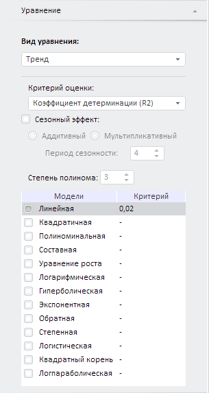

# Тренд

Тренд
-

# Тренд

Функции тренда позволяют исключить из временного ряда сезонную составляющую
 и построить теоретический временной ряд, в основе которого лежит математически-выраженная
 закономерность изменения (зависимость).

Примечание.
 В методе «Тренд» входная переменная
 одновременно является и моделируемой. Для создания уравнения установите
 связь переменной с самой собой.

Для настройки параметров метода используйте вкладку «Уравнение»
 на боковой панели.

[Для отображения
 вкладки](javascript:TextPopup(this))

		- Убедитесь, что боковая панель отображается;

		- Выберите моделируемую переменную или одну из связей уравнения
		 вида «Тренд»;

		- Перейдите на вкладку «Уравнение»
		 на боковой панели.

Параметры метода:

	- Критерий оценки. Укажите
	 критерий качества модели. Доступные критерии отбора моделей:

	-

		- [Коэффициент
		 детерминации (R2)](Lib.chm::/05_Statistics/UiModellind_DetermCoeff_R2.htm).
		 Используется по умолчанию. Процент объясненной [дисперсии](Lib.chm::/05_Statistics/UIModelling_dispers.htm)
		 зависимой (объясняемой) переменной. Выбирается модель с наибольшим
		 значением;

		- [Скорректированный
		 коэффициент детерминации (AdjR2)](Lib.chm::/05_Statistics/UiModellind_DetermCoeff_AdjR2.htm). Коэффициент детерминации, скорректированный
		 на число регрессоров. Выбирается модель с наибольшим значением;

		- Сумма квадратов остатков
		 (SSR). Сумма квадратов разностей между прогнозируемым и
		 фактическим значением. Выбирается модель с наименьшим значением;

		- Стандартная ошибка регрессии
		 (SER). Мера ошибки предсказанного значения y для отдельного значения x. Выбирается модель с наименьшим значением;

	- Сезонный эффект. По
	 умолчанию флажок снят. Коэффициенты уравнения оцениваются методом
	 наименьших квадратов на основе исходного ряда.

	Если флажок установлен, то при расчёте учитывается сезонный эффект.
	 Укажите модель, применяемую для выделения сезонной составляющей исходного
	 ряда:

	-

		- Аддитивный. Используется
		 по умолчанию. Ряд рассматривается как сумма систематической и
		 нерегулярной составляющих;

		- Мультипликативный.
		 Ряд рассматривается как произведение систематической и нерегулярной
		 составляющих.

Вначале из исходного ряда исключается периодически
 повторяющаяся сезонная компонента. Затем оцениваются коэффициенты
 уравнения с помощью линейного метода наименьших квадратов.

	- Период сезонности. Задайте
	 длину периода сезонности. Параметр доступен, если выбран какой-либо
	 сезонный эффект;

	- Степень полинома. Задайте
	 степень полинома для полиномиальной модели. Значение по умолчанию
	 - «3». Параметр доступен, если в списке исследуемых моделей зависимости
	 установлен флажок «Полиномиальная»;

	- Исследуемые модели зависимостей.
	 Отметьте флажками [модели
	 зависимостей](Lib.chm::/02_Time_series_analysis/UiModelling_TrendCurveEstimation.htm), которые необходимо принять во внимание.

См. также:

[Работа
 с уравнениями](../../Work/Web_Equation_Work.htm) | [Тренд
 с подбором функциональной зависимости](Lib.chm::/02_Time_series_analysis/UiModelling_TrendCurveEstimation.htm)
 | Анализ временных рядов: [тренд](UiDw.chm::/Workbook/CalculatedSeries/Forecast/UiDw_cs_Exponential_Trend.htm)
 | [IModelling.Extrapolate](KeMs.chm::/Interface/IModelling/IModelling.Extrapolate.htm)

		Справочная
		 система на версию 10.9
		 от 18/08/2025,
		 © ООО «ФОРСАЙТ»,
