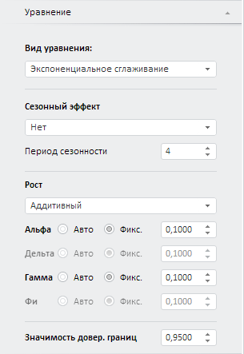

# Экспоненциальное сглаживание (веб-приложение)

Экспоненциальное сглаживание (веб-приложение)
-

# Экспоненциальное сглаживание

Экспоненциальное сглаживание является одним из наиболее распространенных
 приемов выравнивания и прогнозирования широкого класса временных рядов.
 В его основе лежит расчет экспоненциальных средних.

Примечание.
 В методе «Экспоненциальное сглаживание»
 входная переменная одновременно является и моделируемой. Для создания
 уравнения установите связь переменной с самой собой.

Для настройки параметров метода используйте вкладку «Уравнение»
 на боковой панели.

[Для отображения
 вкладки](javascript:TextPopup(this))

		- Убедитесь, что боковая панель отображается;

		- Выберите моделируемую переменную или одну из связей уравнения
		 вида «Экспоненциальное сглаживание»;

		- Перейдите на вкладку «Уравнение»
		 на боковой панели.

Параметры метода:

	- Сезонный эффект. Метод
	 подразумевает выделение сезонной составляющей, когда в исходном ряде
	 наблюдаются достаточно постоянные периодические отклонения в абсолютном
	 выражении от варьирующего во времени среднего уровня ряда с заранее
	 известным периодом. Для отражения [сезонной
	 особенности](Lib.chm::/02_Time_series_analysis/UiModelling_ExpSmooth_season.htm) в модели используется коэффициент «Дельта».

Временной ряд разлагают на систематическую
 (d) и случайную составляющие
 (e). Укажите используемую модель
 сезонности:

	-

		- Нет. Используется
		 по умолчанию;

		- Аддитивная: ŷ = d + e;

		- Мультипликативная: ŷ = de;

	- Период сезонности. Если
	 выбран какой-либо сезонный эффект, то задайте длину периода сезонности.
	 Значение по умолчанию - «4».

Совет.
 Минимальное число наблюдений ряда должно удовлетворять неравенству: число наблюдений >= (Период сезонности * 2 + 1).

	- Рост. Временные ряды
	 часто имеют тенденцию некоторого роста или убывания. В этом случае
	 модель экспоненциального сглаживания использует коэффициент, учитывающий
	 [рост](Lib.chm::/02_Time_series_analysis/UiModelling_ExpSmooth_growthhtm.htm)
	 - «Гамма». Укажите модель
	 роста:

	-

		- Нет. Используется
		 по умолчанию;

		- Аддитивный;

		- Экспоненциальный;

		- Затухающий;

	- Альфа. Дельта.
	 Гамма. Фи.
	 Задайте значения коэффициентов модели. Набор коэффициентов зависит
	 от выбранных параметров роста и сезонного эффекта.

	Если установлен переключатель «Авто»,
	 то коэффициент оценивается автоматически, иначе значение коэффициента
	 задается вручную в соответствующем редакторе чисел. Параметры автоматической
	 оценки коэффициентов настраиваются на вкладке «[Автоподбор параметров](../Autofit_Parameters.htm)»;

	- Значимость довер. границ.
	 Задайте уровень значимости доверительных границ прогнозного ряда.
	 Может принимать значения из интервала (0, 1). Значение по умолчанию
	 - «0,95».

См. также:

[Работа
 с уравнениями](../../Work/Web_Equation_Work.htm) | Метод [экспоненциального
 сглаживания](Lib.chm::/02_Time_series_analysis/UiModelling_ExpSmooth.htm) |
 Анализ временных рядов: [Экспоненциальное
 сглаживание](UiDw.chm::/Workbook/CalculatedSeries/Forecast/UiDw_cs_ExponentialSmoothing.htm) |
 [IModelling.Expsmooth](KeMs.chm::/Interface/IModelling/IModelling.Expsmooth.htm)

		Справочная
		 система на версию 10.9
		 от 18/08/2025,
		 © ООО «ФОРСАЙТ»,
