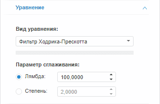

# Фильтр Ходрика-Прескотта (веб-приложение)

Фильтр Ходрика-Прескотта (веб-приложение)
-

# Фильтр Ходрика-Прескотта

Фильтр Ходрика-Прескотта - это метод сглаживания временного ряда, который
 используется для выделения длительных тенденций временного ряда.

Примечание.
 В методе «Фильтр Ходрика-Прескотта»
 входная переменная одновременно является и моделируемой. Для создания
 уравнения установите связь переменной с самой собой.

Для настройки параметров метода используйте вкладку «Уравнение»
 на боковой панели.

[Для отображения
 вкладки](javascript:TextPopup(this))

		- Убедитесь, что боковая панель отображается;

		- Выберите моделируемую переменную или одну из связей уравнения
		 вида «Фильтр Ходрика-Прескотта»;

		- Перейдите на вкладку «Уравнение»
		 на боковой панели.

Параметры метода:

	- Параметр
	 сглаживания. Управляет мерой гладкости ряда. Чем больше значение
	 параметра, тем более гладким получается ряд. Если значение параметра
	 сглаживания стремится к бесконечности, то ряд превращается в линейный
	 тренд. Укажите способ задания параметра сглаживания:

	-

		- Лямбда. Установлен
		 по умолчанию. Параметр сглаживания определяется значением лямбды.
		 Значение по умолчанию - «100»;

		- Степень. Параметр
		 сглаживания определяется значением степени, которое должно быть
		 больше нуля. Значение по умолчанию - «2». Параметр недоступен
		 для модели «Фильтр Ходрика-Прескотта
		 (R)».

См. также:

[Работа
 с уравнениями](../../Work/Web_Equation_Work.htm) | Анализ временных
 рядов: [Фильтр
 Ходрика-Прескотта](UiDw.chm::/Workbook/CalculatedSeries/Smoothing/UiDw_cs_HodrickPrescottFilter.htm) |
 [IModelling.Hpf](KeMs.chm::/Interface/IModelling/IModelling.Hpf.htm)
 | [IModelling.Hpfp](KeMs.chm::/Interface/IModelling/IModelling.Hpfp.htm)

		Справочная
		 система на версию 10.9
		 от 18/08/2025,
		 © ООО «ФОРСАЙТ»,
