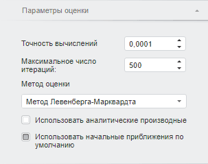

# Нелинейная регрессия (веб-приложение)

Нелинейная регрессия (веб-приложение)
-

# Нелинейная регрессия

Метод позволяет выполнять нелинейные преобразования данных. Для
 настройки параметров метода используйте вкладку «Уравнение»
 на боковой панели.

[Для отображения
 вкладки](javascript:TextPopup(this))

		- Убедитесь, что боковая панель
		 отображается.

		- Выберите моделируемую переменную или одну из связей уравнения
		 вида «Нелинейная регрессия».

		- Перейдите на вкладку «Уравнение»
		 на боковой панели.

Параметры метода:

	- Значимость довер. границ.
	 Задайте уровень значимости доверительных границ прогнозного ряда.
	 Может принимать значения из интервала (0, 1). Значение по умолчанию
	 - 0,95.

Совет. Для редактирования
 начальных значений коэффициентов используйте вкладку «[Спецификация](../../ResultsPanel/UiModelling_w_rp_specification.htm)»
 на панели результатов.

## Настройка параметров оценки нелинейной
 регрессии

Для настройки параметров оценки нелинейной регрессии используйте вкладку
 «Параметры оценки» на боковой
 панели.

[Для отображения
 вкладки](javascript:TextPopup(this))

		- Убедитесь, что боковая панель
		 отображается.

		- Выберите моделируемую переменную или одну из связей уравнения
		 нелинейной регрессии.

		- Перейдите на вкладку «Параметры
		 оценки».

Параметры оценки нелинейной регрессии:

	- Точность вычислений.
	 Укажите точность вычислений уравнения. Минимальное значение: 0.00001;
	 значение по умолчанию: 0.0001;

	- Максимальное число итераций.
	 Задайте максимальное число итераций, за которое должны быть получены
	 оценки коэффициентов нелинейной регрессии. При большом числе итераций
	 достигается наибольшая точность вычислений, но затрачивается больше
	 времени.

	Минимальное значение: 1; значение по умолчанию: 500;

	- [Метод оценки](Lib.chm::/02_Time_series_analysis/Lib_ARIMA_Coef.htm).
	 Из раскрывающегося списка выберите метод оценки коэффициентов нелинейной
	 регрессии;

	- Использовать аналитические
	 производные. Установка данного флажка повышает точность расчетов,
	 путем расчета аналитических производных для уравнения нелинейной регрессии;

	- Использовать начальные приближения
	 по умолчанию. По умолчанию флажок установлен и для расчета
	 используются начальные приближения коэффициентов уравнения, заданные
	 по умолчанию. Если флажок снят, то используются начальные приближения,
	 заданные пользователем. Для просмотра и редактирования начальных приближений
	 используйте вкладку «[Спецификация](../../ResultsPanel/UiModelling_w_rp_specification.htm#nonlinearregr)»
	 на панели результатов.

См. также:

[Работа
 с уравнениями](../../Work/Web_Equation_Work.htm) |
 Метод расчёта [нелинейной
 регрессии](Lib.chm::/01_Regression_models/UiModelling_NonLinearRegr.htm) |Анализ
 временных рядов: [Нелинейная
 регрессия](UiDw.chm::/Workbook/CalculatedSeries/Regression/UiDw_cs_NonLinearRegression.htm)

		Справочная
		 система на версию 10.9
		 от 18/08/2025,
		 © ООО «ФОРСАЙТ»,
