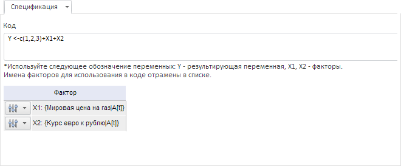

# Пользовательский код

Пользовательский код
-

# Пользовательский код

Метод позволяет выполнить преобразование данных с помощью методов пакета
 R.

Примечание.
 Методы R доступны, если в «Форсайт. Аналитическая платформа»
 подключен пакет R. Подробнее см. раздел: «[Как
 настроить интеграцию с R?](../../../FAQ/R_Integration.htm)».

Для настройки параметров метода используйте вкладку «Спецификация»
 на панели результатов.

[Для отображения
 вкладки](javascript:TextPopup(this))

		- Убедитесь, что [панель
		 результатов](../../UiModelling_w_ResultPanel.htm) отображается.

		- Выберите моделируемую переменную или одну из связей уравнения
		 вида «Пользовательский код»;

		- Перейдите на вкладку «Спецификация»
		 на панели результатов.

В поле «Код» сформируйте выражение
 для преобразования данных. В выражении можно использовать факторы. Каждому
 фактору сопоставлен элемент с идентификатором вида Xn,
 где n - номер по порядку.

Для формирования выражения используйте язык R. Более подробное описание
 об языке R приведено в [документации
 к R](http://cran.r-project.org/manuals.html).

См. также:

[Работа с уравнениями](../../Work/Web_Equation_Work.htm)
 | [R](../../../2_Container_of_Modeling/2_3_Work_object/2_3_2_Model/Specification/R.htm)

		Справочная
		 система на версию 10.9
		 от 18/08/2025,
		 © ООО «ФОРСАЙТ»,
