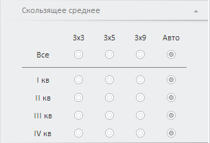
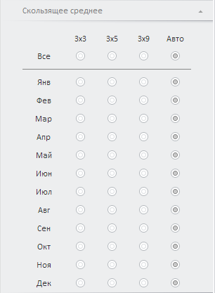

# Настройка параметров скользящего среднего

Настройка параметров скользящего среднего
-

# Настройка параметров скользящего среднего

Для настройки параметров скользящего среднего в уравнении «[X11](w_eq_X11.htm)» предназначена вкладка «Скользящее
 среднее», расположенная на боковой панели. Скользящее среднее применяется
 для расчета значений на основе среднего значения переменной для указанного
 числа предшествующих периодов.

[Для отображения
 вкладки](javascript:TextPopup(this))

		- Убедитесь, что боковая панель отображается;

		- Выберите моделируемую переменную или одну из связей уравнения
		 вида «X11»;

		- Перейдите на вкладку «Скользящее
		 среднее» на боковой панели.

Вид вкладки различается в зависимости от календарной динамики исходной
 переменной:

	- квартальная динамика:

	- месячная динамика:

Независимо от календарной динамики вкладка содержит следующие переключатели,
 определяющие метод расчёта скользящего среднего:

	- 3х3. Представляет собой
	 переменную, которая получена путём двукратного применения скользящего
	 среднего по трём наблюдениям к заданной переменной. Эта процедура
	 эквивалента взвешенному скользящему среднему по 5 наблюдениям;

	- 3х5. Процедура сглаживания
	 переменной, при которой исходная переменная сначала сглаживается по
	 5 соседним точкам, а затем к полученным данным применяется процедура
	 трехточечного скользящего среднего. Это эквивалентно сглаживанию по
	 7 точкам;

	- 3х9. Процедура сглаживания
	 переменной, при которой исходная переменная сначала сглаживается по
	 9 соседним точкам, а затем к полученным данным применяется процедура
	 трехточечного скользящего среднего;

	- Авто. Метод расчёта
	 скользящего среднего выбирается автоматически.

Установите переключатель, соответствующий методу расчёта скользящего
 среднего, для каждого элемента календарной динамики.

Совет. Для выбора
 метода расчёта сразу для всех элементов календарной динамики установите
 соответствующий переключатель в строке «Все».

См. также:

[X11](w_eq_X11.htm) | [Работа с уравнениями](../../Work/Web_Equation_Work.htm)

		Справочная
		 система на версию 10.9
		 от 18/08/2025,
		 © ООО «ФОРСАЙТ»,
