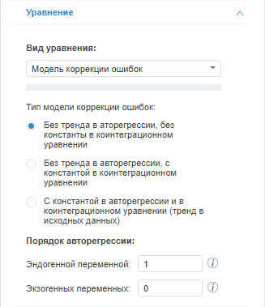

# Модель коррекции ошибок (веб-приложение)

Модель коррекции ошибок (веб-приложение)
-

# Модель коррекции ошибок

Метод предназначен для коррекции ошибок в данных. Для настройки параметров
 метода используйте вкладку «Уравнение»
 на боковой панели.

[Для отображения
 вкладки](javascript:TextPopup(this))

		- Убедитесь, что боковая панель отображается;

		- Выберите моделируемую переменную или одну из связей уравнения
		 вида «Модель коррекции ошибок»;

		- Перейдите на вкладку «Уравнение»
		 на боковой панели.

Параметры метода:

	- Тип модели коррекции ошибок.
	 Укажите используемый тип модели:

	-

		- Без тренда в авторегрессии, без константы в коинтеграционном
		 уравнении;

		- Без тренда в авторегрессии, с константой в коинтеграционном
		 уравнении;

		- С константой в авторегрессии и в коинтеграционном уравнении
		 (тренд в исходных данных);

	- Порядок авторегрессии.
	 Укажите порядок авторегрессии для эндогенной (моделируемой) и экзогенных
	 (входных) переменных. Введите номера или диапазоны порядка авторегрессии,
	 разделенные запятыми. Диапазон порядка авторегрессии указывается через
	 знак «-».

Совет. Для каждой
 экзогенной переменной можно [задать
 группу](../../Work/Varables/Var_Fast_Transform.htm), определяющую тип коинтеграционной связи. Используйте вкладку
 «[Факторы](../../ResultsPanel/w_rp_factors.htm)»
 на [панели результатов](../../UiModelling_w_ResultPanel.htm).

См. также:

[Работа
 с уравнениями](../../Work/Web_Equation_Work.htm) |Метод расчёта [модели
 коррекции ошибок](Lib.chm::/02_Time_series_analysis/UiModelling_ErrCorrModel.htm) |Анализ
 временных рядов: [Модель
 коррекции ошибок](UiDw.chm::/Workbook/CalculatedSeries/Regression/UiDw_cs_ErrorCorrectionModel.htm)
 | [IModelling.Ecm](KeMs.chm::/Interface/IModelling/IModelling.Ecm.htm)

		Справочная
		 система на версию 10.9
		 от 18/08/2025,
		 © ООО «ФОРСАЙТ»,
