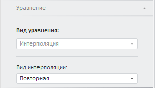

# Интерполяция (веб-приложение)

Интерполяция (веб-приложение)
-

# Интерполяция

Метод рассчитывает данные нижнего уровня на основе данных верхнего уровня.
 Применяется в задачах, требующих дезагрегации данных. Например, данные
 квартальной динамики необходимо распределить по месяцам.

Примечание.
 Для дезагрегации данных календарная динамика входной переменной должна
 быть больше динамики моделируемой переменной. Если календарная динамика
 входной переменной меньше или совпадает с динамикой моделируемой переменной,
 то создание уравнения «Интерполяция»
 недоступно.

Для настройки параметров метода используйте вкладку «Уравнение»
 на боковой панели.

[Для отображения
 вкладки](javascript:TextPopup(this))

		- Убедитесь, что боковая панель отображается.

		- Выберите моделируемую переменную или одну из связей уравнения
		 вида «Интерполяция».

		- Перейдите на вкладку «Уравнение»
		 на боковой панели.

	- Вид интерполяции. Укажите
	 метод интерполяции, применяемый к входной переменной. Если у метода
	 есть параметры, то отобразится поле для ввода их значений. Доступные
	 методы интерполяции:

	- Повторная. Значения
	 моделируемой динамики будут повторять имеющиеся значения динамики
	 исходной переменной. Метод без параметров;

	- Равномерная. Для моделирования
	 используется равномерная интерполяция. Каждая точка исходной динамики
	 равномерно раскладывается на соответствующие точки моделируемой динамики.
	 Например, квартальные за 2008 год получаются путем разложения годовых
	 данных за 2008 год на четыре равные части. Метод без параметров;

	- Линейная. Значения моделируемой
	 динамики рассчитываются по уравнению прямой, соединяющей имеющиеся
	 точки исходной динамики. Метод без параметров;

	- Геометрическая. Значения
	 моделируемой динамики пропорциональны значению инкремента и обратно
	 пропорциональны фактору, вычисленному на основе инкремента. Инкремент
	 экспоненциально зависит от логарифма относительного прироста исходной
	 динамики, умноженного на длину периода моделируемой динамики. Метод
	 без параметров;

	- Кубическими сплайнами.
	 Значения моделируемой динамики рассчитываются по уравнению кривой,
	 проходящей через набор точек таким образом, что первые и вторые производные
	 кривой непрерывны в каждой точке. Эта кривая образуется путем создания
	 ряда кубических полиномов, проходящих через наборы из трех смежных
	 точек. Затем кубические полиномы состыковываются друг с другом, чтобы
	 образовать одну кривую. Метод без параметров;

	- Многочленом Лагранжа.
	 Основная идея этого метода состоит в том, чтобы найти многочлен, который
	 принимает значение «1» в одной узловой точке и «0» во всех других.
	 Метод без параметров;

	- Полиномиальная. Для
	 моделирования используется интерполяция полиномом указанной степени.
	 Степень полинома задается в редакторе чисел «Степень
	 полинома». Минимальное значение степени полинома - единица;

	- По шаблону. Для моделирования
	 используется интерполяция по шаблону. Задайте параметры «Вид
	 шаблона» и «Шаблонный ряд».
	 В раскрывающемся списке «Вид шаблона»
	 укажите шаблон, по которому выполняется интерполяция. Доступные шаблоны:

	-

		- Среднее по элементам;

		- По первому элементу;

		- По последнему элементу;

В раскрывающемся иерархическом списке «Шаблонный ряд» укажите переменную,
 представляющую собой образцовый ряд данных.

[Как
 задать/очистить параметр «Шаблонный ряд»?](javascript:TextPopup(this))

	Для задания шаблонного ряда:

		-

			- выберите переменную в области представления данных (представление
			 «[Схема](../../UiModeling_w_ViewArea.htm)»);

			- зажмите кнопку мыши и перетащите переменную в
			 поле «Шаблонный ряд»;

			- отпустите кнопку мыши. Значения переменной будут использованы
			 для заполнения пропусков.

	Для удаления шаблонного ряда нажмите
	 кнопку .

	- Первое значение. Значение
	 первой точки результирующей динамики будет совпадать со значением
	 точки на исходной динамике. Значения в остальных точках результирующей
	 динамики остаются пустыми;

	- Последнее значение.
	 Значение последней точки результирующей динамики будет совпадать со
	 значением точки на исходной динамике. Значения в остальных точках
	 результирующей динамики остаются пустыми.

См. также:

[Работа
 с уравнениями](../../Work/Web_Equation_Work.htm) | [Методы
 интерполяции](Lib.chm::/03_Transformations/UiModelling_Interpolation.htm) |
 Анализ временных рядов: [Интерполяция](UiDw.chm::/Workbook/CalculatedSeries/Aggregation/UiDw_cs_ProportionalInterpolation.htm)
 | [IModelling.Interpolate](KeMs.chm::/Interface/IModelling/IModelling.Interpolate.htm)
 | [IModelling.InterpolateP](KeMs.chm::/Interface/IModelling/IModelling.InterpolateP.htm)

		Справочная
		 система на версию 10.9
		 от 18/08/2025,
		 © ООО «ФОРСАЙТ»,
