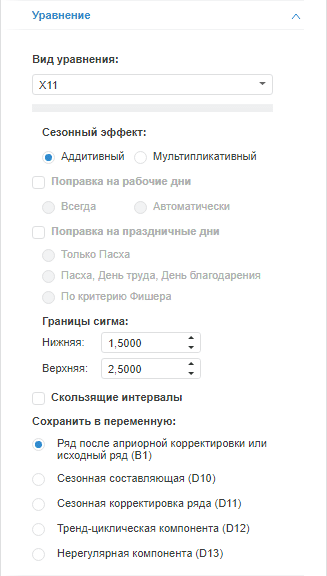

# X11

X11
-

# X11

X11 - метод сезонной декомпозиции и корректировки. Производит разложение
 исходной переменной на сезонную, тренд-циклическую и нерегулярную составляющие,
 проводит сезонную корректировку.

Примечание.
 В методе «X11» входная переменная
 одновременно является и моделируемой. Для создания уравнения установите
 связь переменной с самой собой. Метод доступен только для переменных месячной
 или квартальной динамики.

Метод поддерживается только в ОС Windows.

Для настройки параметров метода используйте следующие вкладки на боковой
 панели:

	- Уравнение. Позволяет
	 изменить базовые параметры расчёта: применяемую модель сезонности,
	 применяемые поправки и т.д.;

	- [Скользящее среднее](X11_MA.htm).
	 Позволяет задать метод расчёта скользящего среднего для каждого элемента
	 календарной динамики исходного ряда;

	- [Весовые
	 коэффициенты](X11_Weights.htm). Позволяет задать весовые коэффициенты для
	 дней недели.

[Для отображения
 вкладки «Уравнение»](javascript:TextPopup(this))

		- Убедитесь, что боковая панель отображается.

		- Выберите моделируемую переменную или одну из связей уравнения
		 вида «X11».

		- Перейдите на вкладку «Уравнение»
		 на боковой панели.

Параметры метода:

	- Сезонный эффект. Укажите
	 модель, применяемую для выделения сезонной составляющей исходной переменной:

	-

		- Аддитивная. Используется
		 по умолчанию. Переменная рассматривается как сумма систематической
		 и нерегулярной составляющих;

		- Мультипликативная.
		 Переменная рассматривается как произведение систематической и
		 нерегулярной составляющих;

	- Поправка на рабочие дни.
	 Если флажок установлен, то выполняется поправка на рабочие дни. Способы
	 поправки:

	-

		- Всегда. Делается
		 поправка на рабочие дни;

		- Автоматически. Определяется
		 автоматически: делать ли поправку на рабочие дни.

Примечание.
 Поправка на рабочие дни применяется только для месячных данных.

	- Поправка на праздничные дни.
	 Если флажок установлен, то выполняется поправка на праздничные дни.
	 Поправка позволяет повысить точность расчетов. Способы поправки:

	-

		- Только Пасха;

		- Пасха, День труда, День
		 благодарения;

		- По [критерию
		 Фишера](lib.chm::/05_statistics/uimodelling_f_test.htm).

Примечание.
 Поправка на праздничные дни применяется только для мультипликативной модели
 сезонности, рассчитываемой на месячных данных.

	- Границы сигма. Большинство
	 переменных содержит выбросы. Они могут исказить оценки сезонности
	 и тренда. Метод «X11» дает
	 возможность уменьшить влияние выбросов, исключив из рассмотрения значения,
	 выходящие за определённый диапазон, либо преобразовав такие значения.

	Ширина диапазона задаётся нижней и верхней границей сигма в группе
	 параметров «Границы сигма».
	 По умолчанию нижняя граница равна «1,5», верхняя - «2,5»;

	- Скользящие интервалы.
	 Если флажок установлен, то при расчёте используются скользящие интервалы.
	 По умолчанию флажок снят;

	- Сохранить в переменную.
	 Укажите данные, которые будут выгружаться в моделируемую переменную:

		- Ряд после априорной корректировки или исходный ряд (B1);

		- Сезонная составляющая (D1);

		- Сезонная корректировка ряда (D11);

		- Тренд-циклическая компонента (D12);

		- Нерегулярная компонента (D13).

Для получения подробной информации о выгружаемых данных обратитесь к
 статье «[Census1](Lib.chm::/02_Time_series_analysis/UiModelling_Census1.htm)».

См. также:

[Работа
 с уравнениями](../../Work/Web_Equation_Work.htm) | Метод «[X11](Lib.chm::/02_Time_series_analysis/UiModelling_Census2.htm)»
 | Анализ временных рядов: [выделение
 сезонности](UiDw.chm::/Workbook/CalculatedSeries/Smoothing/UiDw_cs_Seasonality_Month.htm) | [IModelling.X11](KeMs.chm::/Interface/IModelling/IModelling.X11.htm)

		Справочная
		 система на версию 10.9
		 от 18/08/2025,
		 © ООО «ФОРСАЙТ»,
