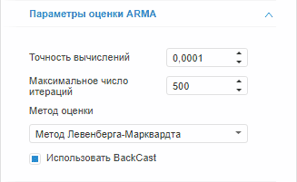

# Настройка параметров авторегрессии и скользящего среднего (веб-приложение)

Настройка параметров авторегрессии и скользящего среднего (веб-приложение)
-

# Настройка параметров авторегрессии и скользящего среднего

для настройки параметров оценки коэффициентов авторегрессии/скользящего
 среднего (ARMA) предназначена вкладка «Параметры
 оценки ARMA», расположенная на боковой панели. Вкладка отображается,
 если для уравнения задан порядок ARMA.

Примечание.
 Если для метода расчёта нельзя задать порядки авторегрессии и скользящего
 среднего, то настройка параметров оценки ARMA недоступна.

[Для отображения
 вкладки](javascript:TextPopup(this))

		- Убедитесь, что боковая панель отображается.

		- Выберите моделируемую переменную или одну из связей уравнения.

		- Перейдите на вкладку «Уравнение».

		- Задайте порядок авторегрессии или скользящего среднего.

		- Перейдите на вкладку «Параметры
		 оценки ARMA» в боковой панели.

Параметры оценки ARMA:

	- Точность вычислений.
	 Укажите точность вычислений уравнения. Минимальное значение: 0.00001;
	 значение по умолчанию: 0.0001;

	- Максимальное число итераций.
	 Задайте максимальное число итераций, за которое должны быть получены
	 оценки коэффициентов ARMA. При большом числе итераций достигается
	 наибольшая точность вычислений, но затрачивается больше времени.

	Минимальное значение: 1; значение по умолчанию: 500;

	- [Метод оценки](Lib.chm::/02_Time_series_analysis/Lib_ARIMA_Coef.htm).
	 Из раскрывающегося списка выберите метод оценки коэффициентов ARMA;

	- Использовать BackCast.
	 Параметр доступен, если для уравнения задан порядок скользящего среднего.
	 Если флажок установлен, то для оценивания коэффициентов скользящего
	 среднего используется ретрополяция (построение графика для прошлого
	 периода на базе тенденций и данных ближайшего прошлого или текущего
	 периода).

См. также:

Боковая
 панель | [Работа
 с уравнениями](../Work/Web_Equation_Work.htm)

		Справочная
		 система на версию 10.9
		 от 18/08/2025,
		 © ООО «ФОРСАЙТ»,
