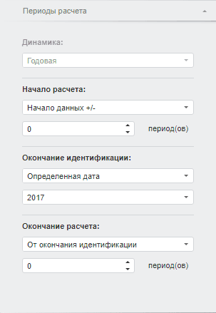

# Настройка периодов расчета (веб-приложение)

Настройка периодов расчета (веб-приложение)
-

# Настройка периодов расчета

Для настройки параметров периодов расчета уравнения предназначена вкладка
 «Периоды расчета», расположенная
 на боковой панели.

[Для отображения
 вкладки](javascript:TextPopup(this))

		- Убедитесь, что боковая панель
		 отображается;

		- Выберите моделируемую переменную или одну из связей уравнения;

		- Перейдите на вкладку «Периоды
		 расчета» в боковой панели.

Параметры периодов расчета:

	- Динамика. Отображает
	 динамику, по которой рассчитывается уравнение;

	- Начало расчета. Начальная
	 точка периода идентификации. В раскрывающемся списке укажите способ
	 расчета даты начала периода:

	-

		- Начало данных +/-.
		 Дата равна первой фактической дате входного ряда плюс число периодов,
		 указанных в соответствующем редакторе чисел;

		- Определенная дата.
		 Используется по умолчанию. Дата указывается в соответствующем
		 редакторе дат;

		- Сегодня +/-. Дата
		 равна текущему числу плюс число периодов, указанных в соответствующем
		 редакторе чисел;

		- От окончания идентификации.
		 Дата начала периода идентификации равна дате окончания периода
		 идентификации минус число периодов, указанных в соответствующем
		 редакторе чисел;

		- От периодов модели.
		 Дата начала идентификации уравнения равна дате начала идентификации
		 модели плюс число периодов, указанных в соответствующем редакторе
		 чисел;

	- Окончание идентификации.
	 Конечная точка периода идентификации. В раскрывающемся списке укажите
	 способ расчета даты окончания периода:

	-

		- Окончание данных +/-.
		 Дата равна последней фактической дате входного ряда плюс число
		 периодов, указанных в соответствующем редакторе чисел;

		- Определенная дата.
		 Используется по умолчанию. Дата указывается в соответствующем
		 редакторе дат;

		- Сегодня +/-. Дата
		 равна текущему числу плюс число периодов, указанных в соответствующем
		 редакторе чисел;

		- От начала идентификации.
		 Дата окончания периода идентификации равна дате начала периода
		 идентификации плюс число периодов, указанных в соответствующем
		 редакторе чисел;

		- От периодов модели.
		 Дата окончания идентификации уравнения равна дате окончания идентификации
		 модели плюс число периодов, указанных в соответствующем редакторе
		 чисел;

	- Окончание расчета. Конечная
	 точка прогнозного ряда. В раскрывающемся списке укажите способ расчета
	 даты:

	-

		- Окончание данных +/-.
		 Дата равна последней фактической дате входного ряда плюс число
		 периодов, указанных в соответствующем редакторе чисел;

		- Определенная дата.
		 Используется по умолчанию. Дата указывается в соответствующем
		 редакторе дат;

		- От окончания идентификации.
		 Дата окончания периода прогноза равна дате окончания периода идентификации
		 плюс число периодов, указанных в соответствующем редакторе чисел;

		- Сегодня +/-. Дата
		 равна текущему числу плюс число периодов, указанных в соответствующем
		 редакторе чисел;

		- От периодов модели.
		 Дата окончания прогнозного ряда уравнения равна дате окончания
		 прогнозного ряда модели плюс число периодов, указанных в
		 соответствующем редакторе чисел.

Примечание.
 Если для расчета даты используется способ «Сегодня
 +/-», то даты окончания идентификации и прогнозирования смещаются
 на конец периода. Актуально для динамик от месячной и выше.

Например, дата окончания идентификации - апрель 2012, а дата окончания
 расчета равняется дате окончания идентификации. Таким образом, при вычислении
 уравнения дата окончания расчета - 30.04.2012.

См. также:

Боковая панель | [Работа
 с уравнениями](../Work/Web_Equation_Work.htm)

		Справочная
		 система на версию 10.9
		 от 18/08/2025,
		 © ООО «ФОРСАЙТ»,
