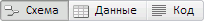
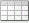
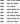
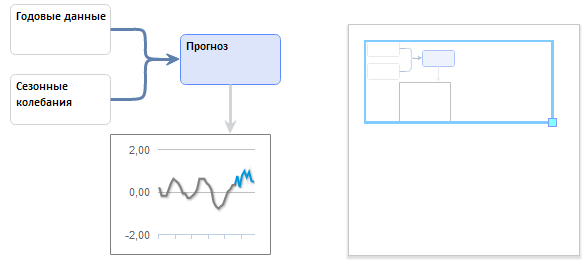
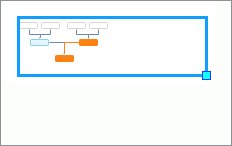
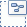
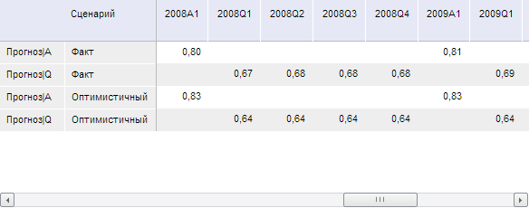
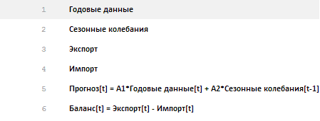

# Область представления данных

Область представления данных
-

# Область представления данных

Представление - это табличное, графическое или иное отображение данных
 модели. Для просмотра характеристик объекта, выделенного на представлении,
 предназначена [панель результатов](UiModelling_w_ResultPanel.htm),
 а для настройки параметров - боковая панель.

Для смены текущего представления используйте переключатели в верхней
 части рабочей области:

Для управления набором доступных переключателей используйте кнопки «Схема»,
  «Данные»,
  «Код»
 в группе «Рабочая область» на
 вкладке ленты «Вид».

Доступные представления:

[Схема](javascript:TextPopup(this))

	Схема предназначена для визуального размещения и настройки взаимодействия
	 уравнений, образующих модель, на едином рабочем пространстве. Пример
	 представления:

	

	Для перемещения по схеме предназначены полосы прокрутки и мини-карта.
	 Мини-карта является уменьшенным изображением представления, например:

	

	Прямоугольником выделена та часть представления, которая отображается
	 в данный момент. Оранжевой заливкой отмечены объекты, выделенные на
	 схеме.

	С помощью мини-карты выполняются следующие действия:

		- Изменение масштаба представления.
		 Наведите указатель мыши на правый нижний угол синего прямоугольника,
		 при этом указатель сменит вид на . Зажмите
		 кнопку мыши и растяните/сожмите прямоугольник до необходимого
		 размера.

		Масштаб схемы будет изменен таким образом, чтобы отображались все
		 объекты в прямоугольнике;

		- Перемещение по представлению.
		 Наведите указатель мыши на границу синего прямоугольника, при
		 этом указатель сменит вид на четырехнаправленную стрелку. Зажмите
		 кнопку мыши и переместите прямоугольник в требуемое
		 место представления.

		На схеме будет отображаться та область, которая выделена прямоугольником.

	Для управления мини-картой используйте кнопку  «Мини-карта» на вкладке ленты «Вид»:

		- для отображения мини-карты
		 переведите кнопку в нажатое состояние;

		- для скрытия мини-карты
		 переведите кнопку в ненажатое состояние;

		- для изменения места расположения
		 мини-карты используйте раскрывающееся меню кнопки. Варианты
		 расположения мини-карты на схеме:

		-

			- . В левом
			 нижнему углу;

			- . В левом
			 верхнем углу;

			- . В правом
			 нижнему углу;

			- . в правом
			 верхнем углу.

[Данные](javascript:TextPopup(this))

	Представление предназначено для отображения в табличном виде данных
	 всех переменных, входящих в модель, по всем календарным динамикам.
	 Пример представления:

	

	Для каждого уравнения сначала отображаются выходные переменные,
	 затем - входные.

	В таблице для каждой переменной отображаются: наименование, наименование
	 сценария (если модель рассчитывается по нескольким сценариям), значения.

	Для копирования выделенных данных используйте сочетание клавиш CTRL+C.
	 Редактирование данных недоступно.

[Код](javascript:TextPopup(this))

	Представление предназначено для отображения цепочки расчёта модели
	 в текстовом виде. Например:

	

	Сначала перечисляются все входные переменные, затем - уравнения.

	Данные, отображаемые в представлении, недоступны для копирования
	 и редактирования.

См. также:

[Рабочая область](UiModelling_w_WorkingArea.htm)

		Справочная
		 система на версию 10.9
		 от 18/08/2025,
		 © ООО «ФОРСАЙТ»,
