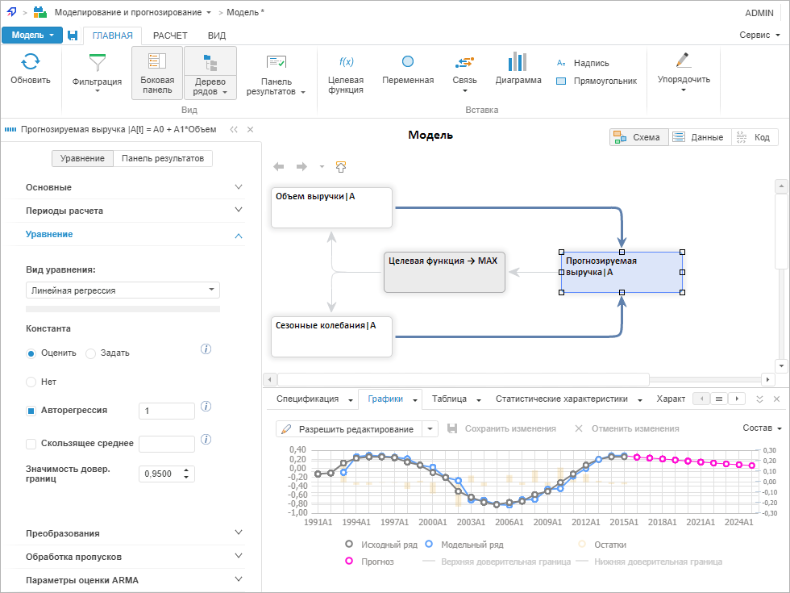

# Описание интерфейса

Описание интерфейса
-

# Описание
 интерфейса моделирования и прогнозирования

Пример окна моделирования и прогнозирования в веб-приложении:

Окно контейнера моделирования содержит:

	- Главное меню. Содержит
	 основные команды для работы с моделированием и прогнозированием. Главное
	 меню состоит из подменю:

		- Модель. Используйте
		 для выполнения базовых операций с моделью;

		- Сервис. Используйте
		 для [настройки параметров](Work/Modelling_setup.htm)
		 инструмента «Моделирование и
		 прогнозирование»;

	- Ленту инструментов.
	 Содержит команды, размещенные на вкладках и упорядоченные в логические
	 группы. Каждая вкладка связана с видом выполняемого действия, например,
	 расчет модели или настройка целевой функции.

	Для получения информации о принципах и особенностях работы с лентой
	 инструментов обратитесь к разделу «[Настройка
	 ленты инструментов](GetStarted.chm::/Interface/Interface_Description.htm#customize_ribbon)»;

	- Боковую панель. Содержит вкладки,
	 предназначенные для настройки параметров объекта, выделенного в рабочей
	 области. Вкладки объединены в группы. Для отображения требуемой группы
	 используйте переключатели в верхней части панели. Набор вкладок в
	 группе зависит от типа объекта, с которым ведется работа. Наименование
	 и пиктограмма объекта отображаются в верхней части панели.

	Для получения информации о принципах и особенностях работы с боковой
	 панелью обратитесь к разделу «[Настройка боковой панели](GetStarted.chm::/Interface/Interface_Description.htm#side_panel)».

	- [Рабочую
	 область](UiModelling_w_WorkingArea.htm). Основная функциональная частью моделирования и прогнозирования,
	 предназначенная для работы с моделью.

См. также:

[Моделирование
 в веб-приложении](WebApplication.htm)

		Справочная
		 система на версию 10.9
		 от 18/08/2025,
		 © ООО «ФОРСАЙТ»,
