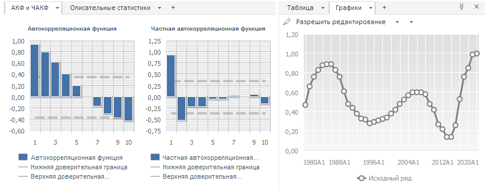
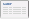
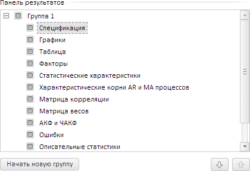

# Панель результатов

Панель результатов
-

# Панель результатов

Панель результатов предназначена для просмотра характеристик объекта,
 выделенного в [области представления
 данных](UiModeling_w_ViewArea.htm). В зависимости от типа выделенного объекта, панель результатов
 может отображать различное количество характеристик. Каждая характеристика
 имеет свою вкладку, на которой отображено её наименование:

Для удобства работы вкладки панели могут быть разбиты на группы. Пример
 панели результатов, разделенной на две группы:

[Отображение/скрытие
 панели](javascript:TextPopup(this))

	Для отображения панели результатов:

		- Перейдите на вкладку «Главная»
		 или «Вид» на ленте инструментов.

		- Переведите кнопку  «Панель результатов» в нажатое
		 состояние.

	Для скрытия панели результатов:

		- нажмите кнопку , расположенную в правом
		 верхнем углу панели результатов;

		- перейдите на вкладку «Главная»
		 или «Вид» на ленте инструментов
		 и переведите кнопку  «Панель результатов» в ненажатое
		 состояние.

[Сворачивание/разворачивание
 панели](javascript:TextPopup(this))

	Для сворачивания панели нажмите кнопку , для
	 разворачивания кнопку . Кнопки расположены в правом
	 верхнем углу панели результатов.

[Переход
 между вкладками](javascript:TextPopup(this))

	Для перехода к нужной характеристике щёлкните по её вкладке.
	 Если вкладки всех характеристик не помещаются в окне браузера, то
	 отображаются кнопки для навигации:

		- . Прокручивает вкладки влево;

		- . Отображает список всех
		 вкладок. Для перехода к требуемой вкладке щелкните по её наименованию;

		- . Прокручивает вкладки вправо.

[Настройка
 параметров панели](javascript:TextPopup(this))

	Для настройки параметров панели результатов используйте группу «Панель результатов» в диалоге «[Параметры](Work/Modelling_setup.htm)».

	Для открытия диалога выполните команду:

		- «Сервис > Параметры»
		 в главном меню;

		- «Настроить вкладки» в
		 раскрывающемся меню кнопки  «Панель результатов» на вкладке
		 «Главная» или «Вид»
		 на ленте инструментов;

		- «Настроить вкладки» в
		 раскрывающемся меню кнопки ,
		 расположенной в заголовке каждой вкладки на панели результатов.

	Команда доступна, если в рабочей области открыта какая-либо [модель](Work/Web_Model_Work.htm).

	Группа «Панель результатов»
	 содержит список вкладок, доступных на панели результатов. Например:

	

	Операции, выполняемые с помощью данной группы:

		- отображение/закрытие вкладок
		 с панели результатов. Установите/снимите флажок, соответствующий
		 вкладке;

		- изменение
		 порядка следования вкладки на панели результатов.

			- Выделите требуемую вкладку.

			- Нажмите кнопку 
			 для перемещения вкладки на одну позицию вниз, кнопку  для перемещения вкладки на одну позицию вверх.
			 Или перетащите вкладку в требуемую позицию.

	Вкладка будет перемещена в указанную
	 позицию;

		- разбиение вкладок панели
		 результатов на группы.

			- Выделите вкладку, которую надо вынести в новую группу.

			- Нажмите кнопку «Начать
			 новую группу».

	Отмеченная вкладка будет перемещена в
	 отдельную группу. Для формирования набора вкладок в созданной группе
	 используйте кнопки  и  или механизм перетаскивания.

[Отображение/закрытие
 вкладок](javascript:TextPopup(this))

	Для отображения вкладки установите флажок, соответствующий вкладке:

		- в раскрывающемся меню кнопки  «Панель результатов» на вкладке
		 «Главная» или «Вид»
		 на ленте инструментов;

		- в группе параметров «[Панель результатов](#adjust_settings)» диалога
		 «[Параметры](Work/Modelling_setup.htm)».

	Вкладка будет отображена на панели результатов.

	Для закрытия вкладки:

		- выполните команду «Закрыть
		 вкладку» в раскрывающемся меню кнопки ,
		 расположенной в заголовке требуемой вкладки;

		- снимите флажок, соответствующий вкладке:

			- в раскрывающемся меню кнопки  «Панель результатов» на вкладке
			 «Главная» или «Вид» на ленте инструментов;

			- в группе параметров «[Панель результатов](#adjust_settings)» диалога
			 «[Параметры](Work/Modelling_setup.htm)».

	Вкладка будет закрыта.

[Изменение
 порядка следования вкладок](javascript:TextPopup(this))

	Для изменения порядка следования вкладки на панели результатов:

		- используйте механизм перетаскивания:

			- Наведите указатель мыши
			 на заголовок вкладки.

			- Зажмите кнопку
			 мыши.

			- Переместите вкладку в требуемую
			 позицию и отпустите кнопку мыши.

		- используйте команды «Влево»
		 и «Вправо» в раскрывающемся
		 меню кнопки , расположенной в заголовке требуемой
		 вкладки;

		- используйте кнопки 
		 и  в группе параметров «[Панель результатов](#adjust_settings)» диалога
		 «[Параметры](Work/Modelling_setup.htm)».

	Порядок следования вкладок будет изменен.

[Разбиение
 вкладок на группы](javascript:TextPopup(this))

	Для разбиения вкладок панели результатов на группы:

		- выполните команду «Начать
		 новую группу» в раскрывающемся меню кнопки , расположенной в заголовке
		 требуемой вкладки;

		- используйте группу параметров «[Панель результатов](#adjust_settings)» в диалоге
		 «[Параметры](Work/Modelling_setup.htm)».

	Вкладки панели результатов будут разбиты на группы.

	Совет. Для разбиения
	 всех вкладок на группы выполните команду «Разделить
	 все вкладки» в раскрывающемся меню кнопки  «Панель результатов» на вкладке «Главная» или «Вид»
	 на ленте инструментов. Для возвращения вкладок к виду по умолчанию
	 выполните команду «Объединить все
	 вкладки» в данном раскрывающемся меню.

[Перемещение
 вкладок между группами](javascript:TextPopup(this))

	Для перемещения вкладок между группами:

		- нажмите кнопку «+»,
		 расположенную после всех вкладок группы. Будет отображен список
		 вкладок, которые могут быть перемещены в группу. Выберите требуемую
		 вкладку;

		- используйте механизм перетаскивания:

			- Наведите указатель мыши
			 на заголовок вкладки.

			- Зажмите кнопку
			 мыши.

			- Переместите вкладку в требуемую
			 группу и отпустите кнопку мыши.

[Копирование
 табличных данных](javascript:TextPopup(this))

	Если на вкладке отображаются табличные данные, то они могут быть
	 скопированы. Выделите требуемые данные и нажмите сочетание клавиш
	 CTRL+C.

См. также:

[Рабочая область](UiModelling_w_WorkingArea.htm)

		Справочная
		 система на версию 10.9
		 от 18/08/2025,
		 © ООО «ФОРСАЙТ»,
