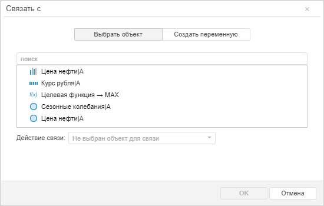
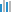
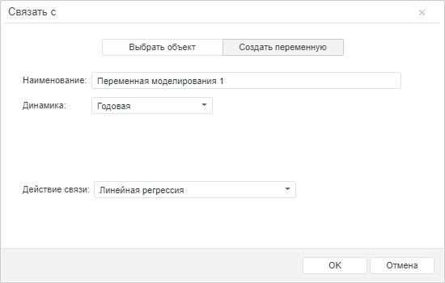

# Расширенное создание уравнения (веб-приложение)

Расширенное создание уравнения (веб-приложение)
-

# Расширенное создание уравнения

Для расширенного создания уравнения используйте диалог «Связать
 с». Для отображения диалога:

	- выделите входную переменную и нажмите кнопку  «Связь» вкладки «Главная»
	 ленты инструментов и в отобразившемся меню нажмите кнопку «Связать
	 с»;

	- наведите указатель мыши на центр входной переменной. Указатель
	 должен принять следующий вид: .
	 Зажмите кнопку мыши и переместите курсор к свободному пространству
	 в рабочей области. Отпустите кнопку мыши.

Будет открыт диалог «Связать с».

Для создания связи с существующим объектом:

	- Установите переключатель «Выбрать
	 объект»:

Будет отображен список объектов, с которыми
 может быть установлена связь. По умолчанию объекты отображаются в виде
 одноуровнего списка. Для выбора режима отображения объектов используйте
 команды в контекстном меню списка. Отображать в виде:

		- Одноуровнего списка.
		 Используется по умолчанию. Объекты отображаются в виде списка
		 без учета [иерархической
		 структуры модели](Hierarchical_structuring_model.htm);

		- Иерархического дерева.
		 Объекты отображаются в виде иерархического дерева, соответствующего
		 [иерархической структуре
		 модели](Hierarchical_structuring_model.htm).

	- Выберите объект, с которым для входной переменной должна быть
	 установлена связь.

	Для поиска объекта используйте строку поиска, расположенную над списком
	 объектов. Введите в строку поиска наименование или часть наименования
	 искомого объекта. Регистрозависимый поиск будет выполняться автоматически
	 по мере ввода искомого текста.

	Для определения типа объектов предназначены их пиктограммы:

		-  - [переменная](UiModelling_w_Varable.htm);

		-  - [уравнение](Web_Equation_Work.htm);

		- 
		 - [визуализатор
		 данных](UiModelling_w_Varable.htm#show_variable_data);

		-  - [целевая
		 функция](OptimalControl/CriterionFunct.htm);

		-  - [ограничение
		 целевой функции](OptimalControl/OptimalControl_setup.htm).

	- В поле «Действие связи»
	 будет отображено действие, выполняемое при создании связи.

		- Если связь устанавливается
		 с переменной. В поле «Действие
		 связи» содержится список методов, доступных для расчета
		 уравнения. Выберите требуемый метод. В результате будет создано
		 уравнение, рассчитываемое выбранным методом. Вид модели можно
		 определить по цвету связи между переменными в модели:

			- синяя. Создано
			 факторное уравнение или нефактороное уравнение, в котором
			 моделируемая переменная совпадает с входной переменной;

			- зеленая. Создано
			 нефакторное уравнение, в котором моделируемая переменная отличается
			 от входной переменной.

		- В остальных случаях.
		 Изменение действия недоступно. В поле «Действие
		 связи» отображается действие, выполняемое для связываемых
		 объектов. Возможные действия:

			- Соединить. Применяется
			 если для создания связи выбран объект, не являющийся переменной
			 или уравнением. Входящая переменная будет связана с выбранным
			 объектом. Например, если входящая переменная связана с визуализатором,
			 то её данные будут отображены в нём;

			- Добавить фактором.
			 Применяется, если для создания связи выбрано факторное уравнение.
			 Входящая переменная будет добавлена в качестве фактора в выбранную
			 модель.

Для создания связи с новой переменной:

	- Установите переключатель «Создать
	 переменную»:

	- В поле «Наименование»
	 укажите наименование создаваемой переменной.

	- В раскрывающемся списке «Динамика»
	 укажите календарную динамику создаваемой переменной.

	- В поле «Действие связи»
	 выберите метод расчета создаваемого уравнения.

Будет создано уравнение, рассчитываемое выбранным методом и использующее
 созданную переменную в качестве моделируемой.

См. также:

[Создание уравнения](Varables/Create_Equation.htm)
 | [Быстрое создание уравнения](Quickly_create_equations.htm)

		Справочная
		 система на версию 10.9
		 от 18/08/2025,
		 © ООО «ФОРСАЙТ»,
